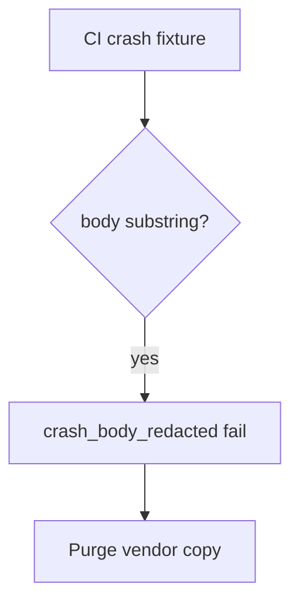

# 8.5-LO-06 — Detect crash_body_redacted without logging the body

**Kind:** operations-exercise
**Loop step:** 6 Operate
**Standards:** NIST CSF 2.0 (final) DE/RS/RC as outcome labels; ASVS `v5.0.0-16.2.5`. MASVS-PRIVACY-4 for user control after a leak.

## Prevention is not absolute

A new SDK version can re-enable “include extras.” Pair detect and recover. Do not log the body you just redacted (3.1).

## Mental model: body in telemetry is a signal



| Outcome | This module |
|---|---|
| Detect | `crash_body_redacted`; CI grep of fixtures |
| Signal | crash id, app version, reason; never the body |
| Recover | Keep redact; purge vendor; notify if needed |
| Residual | Vendor as processor; screenshots; ANR |

## Practice

Write one log line you would accept. Tie it to `labs/8.5/8.5-lab`.

```
log_denied reason=crash_body_redacted crash_id=cr_85e app=release
```

Reject any line that includes a note body, patient name, or a live Crashlytics payload.

## Transfer

Clinic: detect a crash that would have included a synthetic name; do not attach the report body to the ticket.

## Non-goals

A SIEM product name is not the property.
