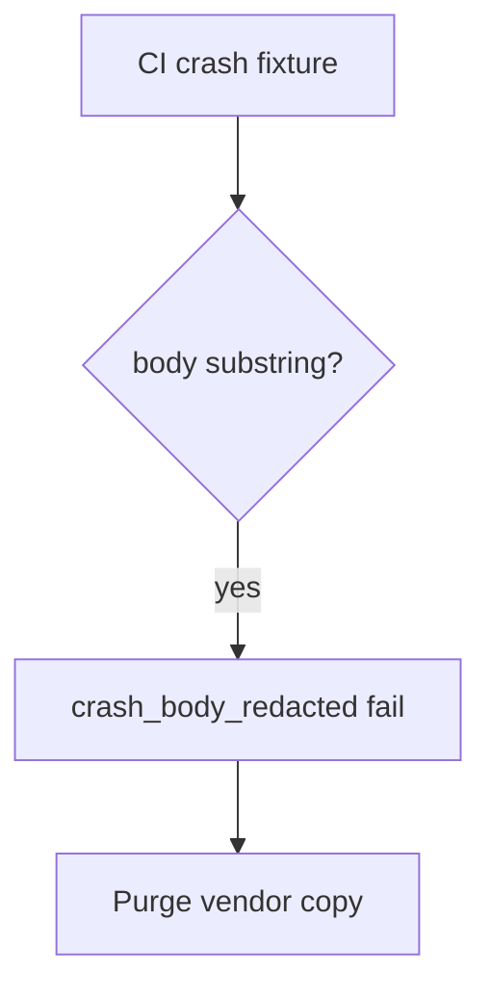

# Redact the crash report without logging the note

**Kind:** operations-exercise
**Loop step:** 6 Operate

## Fixing it once is not enough

A crash-SDK bump can turn “include extras” back on. Do not paste the redacted note or the report body back in.

## Picture: body in telemetry is a signal

If a crash report still holds the note, page the crash id — not the crash body. Then purge the vendor copy.



The crash vendor does not omit the note for you.

If the crash payload still holds the note, `test_crash_report_omits_note_body` is the check. Filling the store privacy form does not omit the note. Tracker SDKs and web crash reports (10.5) can still carry the note; redaction is not done until those sinks are named.

## Signals that do not become a second leak

| Outcome | This topic |
|---|---|
| Notice | `crash_body_redacted`; a CI check of practice files |
| What the line holds | Crash id, app version, reason; **never** the body |
| Respond | Stop the printer that reintroduced the field; do not paste the matching report into chat |
| Recover | Keep the redact; purge the vendor copy; tell people if needed |
| Leftover | The vendor as a processor; screenshots; frozen-app traces; leftover `READ_LOGS` |

A crash dashboard will show crash counts and stay silent when the last extra still holds the note. Detection must observe **`'secret'` absent**, not vendor uptime. If the alert includes the note body, you have opened the same leak as a log line (3.1) and an extra vendor copy (5.1).

```text
log_denied reason=crash_body_redacted crash_id=cr_85e app=release
```

Not: a note body, a patient name, or a live crash payload.

Putting the matching report in the alert puts the crash body in the pager too.

## What the framework does vs what you still have to check

Leftover `READ_LOGS`, tracker extras, and web crash drains still carry the note even if the crash dashboard is green.

## Can people still use it

In-app “send feedback” must not require attaching a screenshot of the note to continue. Offer a text field. Redact that field before send. If operators see a redaction-miss badge, do not encode it as color only.

## Practice

```text
log_denied reason=crash_body_redacted crash_id=cr_85e app=release
```

The log is a leak if it has a note body, a patient name, or a live crash payload.

## Use it somewhere new

Notice a crash that would have included a fake name; do not attach the report body to the ticket. Do not call a live vendor.

## What this page is not doing

Do not use live vendor traces. Answer keys are not on this site.
