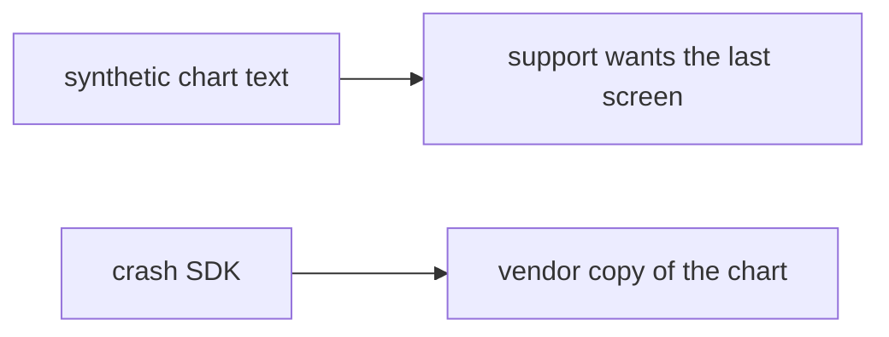

# 8.5-LO-07 — Transfer: clinic crash with a synthetic patient name

**Kind:** transfer-challenge
**Loop step:** 7 Transfer
**Standards:** OWASP MASVS 2.1.0 (final) `MASVS-PRIVACY-1`–`PRIVACY-4`. ASVS 5.0.0 (final) `v5.0.0-16.2.5`. Play Data safety is disclosure. Do not use MASVS L1/L2/R.

## Change the workplace; keep bodies out of telemetry

Do not answer with a Top 10 / CWE / scanner as the definition of security. The SecureCollab sentence was: `crash_report("secret")` must not contain `secret`. Rewrite it for a clinic without changing the fork.

**Prompt:** Clinic crash with a synthetic patient name. Also name web Sentry (10.5).

**Product sketch:** EHR-lite “debug crash includes the last chart so support can reproduce,” plus a completed Play Data safety form.

Rewrite the SecureCollab sentence. Include:

1. attacker capabilities (crash-platform operator, logcat reader — not a live clinic);
2. trust assumptions (redact-before-send is TCB; Play Data safety and Crashlytics automatic are not);
3. forbidden outcome (`'name' in str(crash_report(name))`, not “HIPAA”);
4. a test idea on a **local** fixture only (no live Sentry);
5. residual (vendor processor, screenshots, ANR, leftover `READ_LOGS`);
6. WCAG if a human feedback path exists (must not require a screenshot of the chart).

Use synthetic labels. Do not use real patient names.

## Mental model: same sink, clinical object

If support “needs the last chart” while `crash_report` copies the body, the cell is gone. Crashlytics automatic, Play Data safety, and HTTPS to the vendor do not omit the field. Web Sentry (10.5) is the same sink family — name it, do not call that vendor here. PRIVACY-3 transparency does not delete the field.

The clinic rewrite still has to keep the SecureCollab fork: synthetic name absent from the report, stack may remain. Enabling Crashlytics and completing Data safety without a body-omit test leaves `'name' in str(crash_report(name))` true. The local pytest analogue is `test_crash_report_omits_note_body` — on a fixture, not a live Crashlytics project.

## What graders reject

| Reject | Why |
|---|---|
| “Play Data safety is filled in” | Disclosure, not redaction |
| Live Crashlytics / real names | Lab policy |
| “MASVS L1 privacy” | Obsolete MASVS levels; profiles live in MASTG |
| HTTPS to vendor as this cell | Channel, not omit |
| Crash dialog shown as evidence | Wrong observation |

## Practice

One page. No keys. `labs/8.5/8.5-lab` is the only running system you may break. Do not call a public vendor.

## Non-goals

Live-target telemetry. Real PHI. Claiming Gate 8 from this page.
