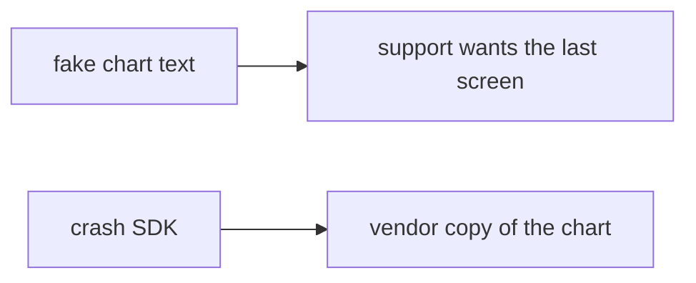

# Somewhere new: clinic crash with a fake patient name

**Kind:** transfer-challenge
**Loop step:** 7 Transfer

## Use it somewhere new

The notes-app scaffolding goes away. You get a **clinic crash**. A fake patient name sits in the last chart. Your job is to rewrite the loop, not to name a bug-list code.

The notes-app sentence was: `crash_report("secret")` must not contain `secret`. Rewrite it for a clinic without changing the fork: field × place, allow or deny. The store’s privacy form is still disclosure, not redaction.

**Product sketch:** an EHR-lite “debug crash includes the last chart so support can reproduce,” plus a completed store privacy form.

## Picture: same place, clinical object

Renaming “note body” to “patient name” is not transfer. Field, place, and leftover change. Enabling a crash product and filling the store form does not omit the field.

| Notes app this week | Clinic sketch |
|---|---|
| Note body is confidential | Fake patient name / chart text is confidential |
| Stack identifier may send | Stack identifier may send |
| `crash_report("secret")` | `crash_report(name)` on a local practice files |
| Crash-platform operator / logcat reader | Same readers — **not** a live clinic |
| Body substring in the JSON | Name substring in the JSON |

If support “needs the last chart” while `crash_report` copies the body, the rule is gone. A crash product set to automatic, the store form, and HTTPS to the vendor do not omit the field. Web crash reports (10.5) are the same place family — name them, do not call that vendor here. A transparency label does not delete the field.

The clinic rewrite still has to keep the notes-app fork: fake name absent from the report, stack may remain. Enabling a crash product and completing the store form without a body-omit test leaves `'name' in str(crash_report(name))` true. The local pytest analogue is `test_crash_report_omits_note_body` — on a practice, not a live crash project.

## Prompt — clinic crash with a fake patient name

Rewrite the notes-app sentence. Include:

1. who can act (crash-platform operator, logcat reader — not a live clinic);
2. what you trust (redact-before-send is the promise; the store form and a crash product set to automatic are not);
3. what must not happen (`'name' in str(crash_report(name))`, not a legal label);
4. a test idea on a **local** practice files only (no live web-crash call);
5. leftover (vendor as processor, screenshots, frozen-app traces, leftover `READ_LOGS`);
6. whether a human feedback path exists (must not require a screenshot of the chart to continue).

Use fake labels. Do not use real patient names.

## What is not good enough

| Reject | Why |
|---|---|
| “The store privacy form is filled in” | Disclosure, not redaction |
| Live crash console / real names | Course rules |
| A privacy-level sticker as the definition | Awareness, not this check |
| HTTPS to the vendor as this topic | Channel, not omit |
| Crash dialog shown as evidence | Wrong observation |

## Practice

One page. No answer keys. `labs/8.5/8.5-lab` is the only running system you may break. Do not call a public vendor.

## What this page is not doing

Live-target telemetry. Real patient charts. Claiming you finished a mobile gate from this page.
