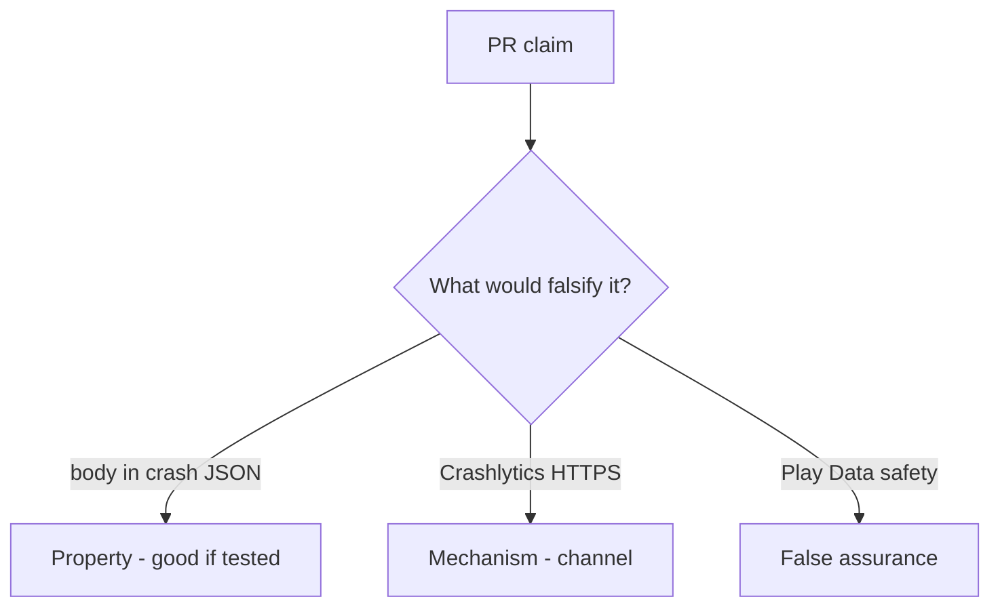

# 8.5-LO-08 — Review crash_report that includes the body as a PR

**Kind:** code-review
**Loop step:** Review
**Standards:** OWASP MASVS 2.1.0 (final) `MASVS-PRIVACY-1`. ASVS `v5.0.0-16.2.5`.

## Review the fixture as if it were SecureCollab crash telemetry

Review `labs/8.5/8.5-lab/vulnerable/` as a SecureCollab PR. Intended findings live only in `content/assessment/keys/8.5.md` — not here.

## Mental model: crash_report includes the body

Start with this seeded smell: **`crash_report` includes the body**. Label it property, mechanism, or false assurance before you accept the PR.

Seeded smells (label them yourself; do not open the keys file):

- `crash_report` includes the body
- Leftover `READ_LOGS`
- Tracker SDK without a processor review
- MASVS spreadsheet row without a test (9.1)

Also reject: live vendor payloads, keys in lessons, MASVS L1/L2/R as current.

## Misconceptions

- Store privacy labels are controls
- Debug logs stay on device
- MASTG is a scanner

## Practice

Write three review notes. Tie at least one to `test_crash_report_omits_note_body`.

## Transfer

Clinic PR that “enabled Crashlytics and completed Data safety” without a body-omit test is incomplete.

## HITL / WCAG 2.2

In-app “send feedback” must not require attaching a screenshot of PHI to proceed.
