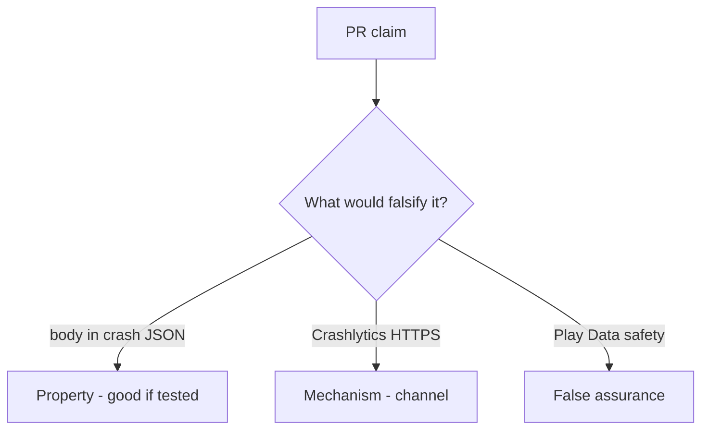

# 8.5-LO-08 — Review crash_report that includes the body as a PR

**Kind:** code-review
**Loop step:** Review
**Standards:** OWASP MASVS 2.1.0 (final) `MASVS-PRIVACY-1`. ASVS 5.0.0 (final) `v5.0.0-16.2.5`. Do not use MASVS L1/L2/R.

## Review the fixture as if it were SecureCollab crash telemetry

Review `labs/8.5/8.5-lab/vulnerable/` as a SecureCollab PR. Your job is not to count suspicious lines. Reconstruct whether `crash_report("secret")` still contains `'secret'`, compare that with the module invariant, and write changes a developer can verify.

Intended findings live only in `content/assessment/keys/8.5.md` — not here. Do not open the keys file until your review has been evaluated.

## Mental model: crash_report includes the body

Start with this seeded smell: **`crash_report` includes the body**. Label it property, mechanism, or false assurance before you accept the PR.

Classification starts at the protected effect (`'secret'` absent). Everything that is not redact-before-send at that call is a candidate telemetry copy. A Play Data safety screenshot without that pytest is the same smell, not a different finding class.

Leftover `READ_LOGS`, tracker SDKs, and 10.5 web Sentry are other sinks — name them, do not skip `test_crash_report_omits_note_body`. MASVS spreadsheet membership without a test is 9.1.

## Seeded smells (label them yourself)

- `crash_report` includes the body
- Leftover `READ_LOGS`
- Tracker SDK without a processor review
- MASVS spreadsheet row without a test (9.1)

Also reject: live vendor payloads; closing findings without re-running `test_crash_report_omits_note_body`; keys in lessons; MASVS L1/L2/R as current.

## Misconceptions this module refuses

- Store privacy labels are controls
- Debug logs stay on device
- MASTG is a scanner
- HTTPS to the vendor is redaction
- MASVS L1/L2/R are current levels

## Practice

Write three review notes a maintainer could act on. Each note: observation, property or false assurance, suggested structural change, residual you will **not** delete. Tie at least one to `test_crash_report_omits_note_body`.

## Transfer

Clinic PR that “enabled Crashlytics and completed Data safety” without a body-omit test is an incomplete confidentiality review. Name the independent falsehood that would still keep `'secret'` out of the report.

## HITL / WCAG 2.2

In-app “send feedback” must not require attaching a screenshot of PHI to proceed.

## Non-goals

Do not merge by adding a comment “will redact later.” That comment is a residual without an owner. Do not call a live vendor to prove the finding.
