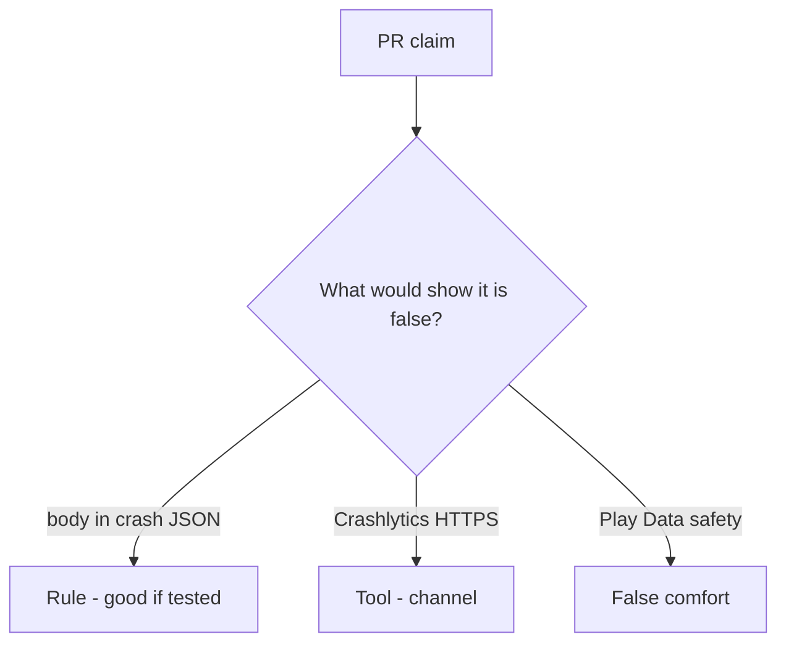

# Review a crash_report that includes the body

**Kind:** code-review
**Loop step:** Review

Intended findings live only in the answer-key folder — not here. Do not open that file until your review has been evaluated.

## What you are reviewing

A colleague ships the notes app’s crash telemetry. Review `labs/8.5/8.5-lab/vulnerable/` as that change. Your job is not to count suspicious lines. Reconstruct whether `crash_report("secret")` still contains `'secret'`, compare that with the rule, and write changes a developer can verify.

Start at `crash_report` and the body×crash row, not at a scanner color or a store screenshot. The check you already ran (`test_crash_report_omits_note_body`) is the rule test. A comment “will redact later” is not.

## Picture: crash_report includes the body

Start with this seeded smell: **`crash_report` includes the body**. Label it rule, tool, or false comfort before you accept the change.

Classification starts at the protected effect (`'secret'` absent). Everything that is not redact-before-send at that call is a candidate extra copy. A store privacy screenshot without that pytest is the same smell, not a different finding class.

Leftover `READ_LOGS`, tracker SDKs, and web crash reports (10.5) are other places — name them, do not skip `test_crash_report_omits_note_body`. A spreadsheet row without a test is 9.1.

## Seeded smells (label them yourself)

- `crash_report` includes the body
- Leftover `READ_LOGS`
- Tracker SDK without a processor review
- A privacy-list spreadsheet row without a test (9.1)

Also reject: live vendor payloads; closing findings without re-running `test_crash_report_omits_note_body`; keys in learner notes; a store privacy form as the fix.

## Common mix-ups

- Store privacy labels are controls
- Debug logs stay on the device
- A testing catalogue is a scanner
- HTTPS to the vendor is redaction
- An old privacy-level sticker is the current bar

## Practice

Write three review notes a maintainer could act on. Each note: what you saw, rule or false comfort, suggested structural change, leftover you will **not** delete. Tie at least one note to `test_crash_report_omits_note_body`. Do not open the keys file.

## Use it somewhere new

Clinic change that “turned on a crash product and completed the store form” without a body-omit test is an incomplete review of where the field can land. Name the independent falsehood that would still keep `'secret'` out of the report.

## Can people still use it

In-app “send feedback” must not require attaching a screenshot of a fake chart to continue.

## What this page is not doing

Do not merge by adding a comment “will redact later.” That comment is leftover without an owner. Do not call a live vendor to prove the finding.
