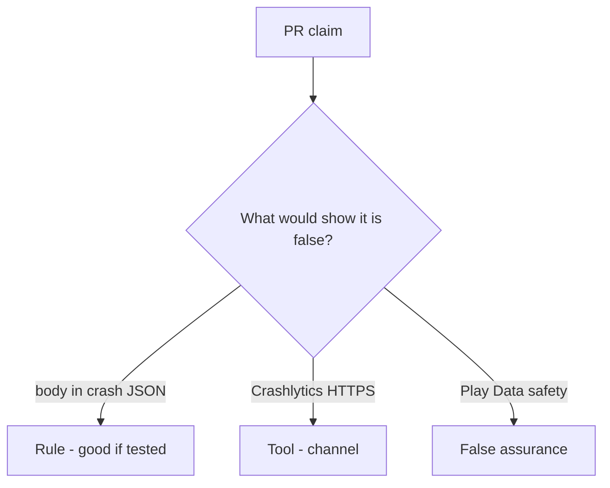

# Review a crash_report that includes the body

**Kind:** code-review
**Loop step:** Review

## What you are reviewing

Review `labs/8.5/8.5-lab/vulnerable/` as a change to the notes app’s crash telemetry. Check whether `crash_report("secret")` still contains `'secret'`.

Start at `crash_report` and the body×crash row, not at a scanner color or a store screenshot. You already ran `test_crash_report_omits_note_body` — that is the rule. A comment “will redact later” is not.

## Picture: crash_report includes the body

**`crash_report` includes the body**.

`'secret'` is still absent. If the change never redacts before send, that extra copy is still open. A store privacy screenshot does not replace that check.

Leftover `READ_LOGS`, tracker SDKs, and web crash reports (10.5) are other places — name them, do not skip `test_crash_report_omits_note_body`. A spreadsheet row without a test is 9.1.

## Problems to find (name them yourself)

- `crash_report` includes the body
- Leftover `READ_LOGS`
- Tracker SDK without a processor review
- A privacy-list spreadsheet row without a test (9.1)

Also reject: live vendor payloads; closing findings without re-running `test_crash_report_omits_note_body`; keys in learner notes; a store privacy form as the fix.

## Common mix-ups

- Store privacy labels are controls
- Debug logs stay on the device
- A testing-guide list is a scanner
- HTTPS to the vendor is redaction
- An old privacy-level sticker is the current bar

## Practice

Write the review that would block this change. Name `test_crash_report_omits_note_body`.

## Use it somewhere new

Clinic change that “turned on a crash product and completed the store form” without a body-omit test is an incomplete review of where the field can land. Name the independent falsehood that would still keep `'secret'` out of the report.

## Can people still use it

In-app “send feedback” must not require attaching a screenshot of a fake chart to continue.

## What this page is not doing

Do not merge by adding a comment “will redact later.” That comment is leftover without an owner. Do not call a live vendor to prove the finding.
