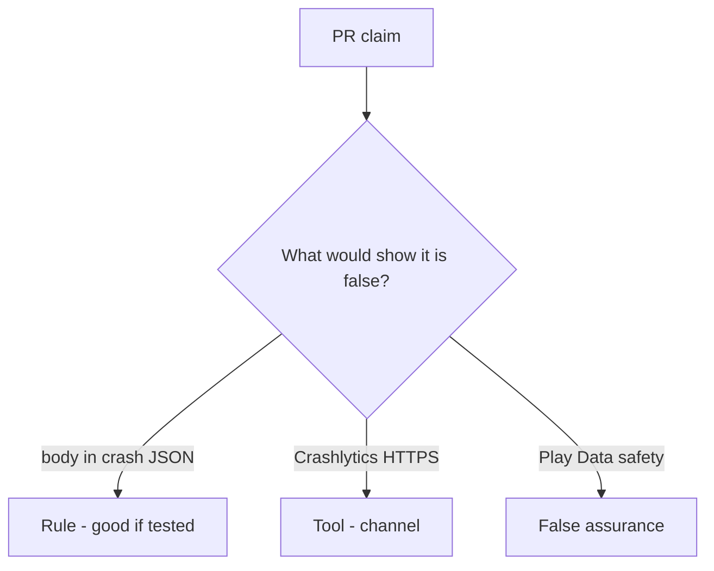

# Review a crash_report that includes the body

**Kind:** code-review
**Loop step:** Review

## What you are reviewing

Look at `labs/8.5/8.5-lab/vulnerable/` as crash telemetry. Does `crash_report("secret")` still contain `'secret'`?

Look at `crash_report` and the body×crash row before a store form. “Will redact later” does not close `test_crash_report_omits_note_body`.

## Picture: crash_report includes the body

**`crash_report` includes the body**.

`'secret'` is still absent. If the change never redacts before send, that extra copy is still open. A store privacy screenshot does not replace that check.

Leftover `READ_LOGS`, tracker SDKs, and web crash reports (10.5) are other places — name them, do not skip `test_crash_report_omits_note_body`. A spreadsheet row without a test is 9.1.

## Problems to find (name them yourself)

- `crash_report` includes the body
- Leftover `READ_LOGS`
- Tracker SDK without a processor review
- A privacy-list spreadsheet row without a test (9.1)

Also reject: live vendor payloads; closing findings without re-running `test_crash_report_omits_note_body`; keys in learner notes; a store privacy form as the fix.

## Common mix-ups

- Store privacy labels are controls
- Debug logs stay on the device
- A testing-guide list is a scanner
- HTTPS to the vendor is redaction
- An old privacy-level sticker is the current bar

## Use it somewhere new

A crash product and a filled store form, without a body-omit test, do not say where the field can land. What would still keep `'secret'` out of the crash report after the store form is filled?

## Can people still use it

In-app “send feedback” must not require attaching a screenshot of a fake chart to continue.

## What this page is not doing

A crash report that still includes the note body, plus “will redact later,” has no owner. Do not call a live vendor to prove the finding.
