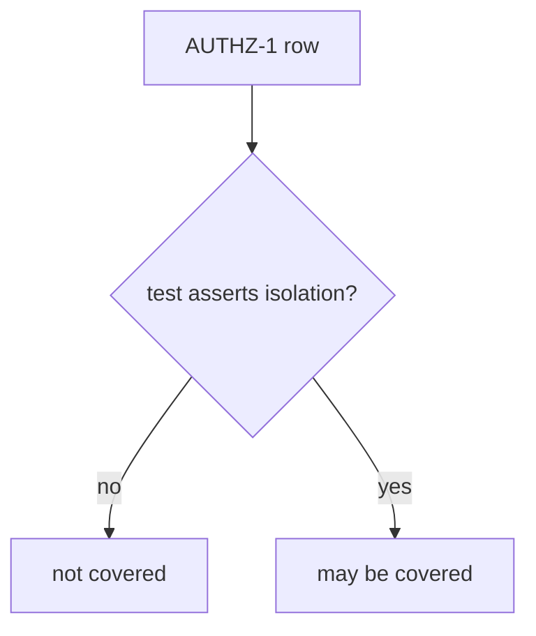
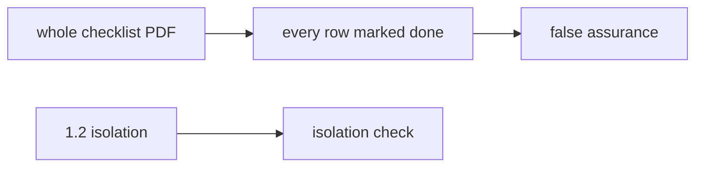

# A done checkbox is not coverage

**Kind:** concept-model
**Loop step:** 1 Property

## The rule

The notes app tracks a requirement we call AUTHZ-1: a member of company A must not read company B’s note. That rule came from the isolation work (1.2) and the object-level check (4.4). A spreadsheet cell that says status is done is **not** that rule.

Coverage is a check over tests. The row must name a test that **asserts isolation** — that company B really cannot read company A’s note.

> `covered("AUTHZ-1", [{"req": "AUTHZ-1", "asserts_isolation": False}])` must be false.

What must not happen: **a status-only row counted as AUTHZ-1 coverage**. That is honesty of the proof you show before a release. If the checkbox is green while the isolation test is missing, company-B holes ship with a green sticker.

A pasted industry checklist is inventory. It is not a tailored matrix. The usual web/API checklist is a backbone you still have to map. An extra advanced row — for example “permission changes apply immediately, including serializers” — still needs a test if you raise it. A development-practice guide that says “test the running code against the requirements” is vocabulary, not a finished verification gate. A later draft of that guide stays a **draft**.

## Picture: coverage is a question about the test



## Picture: pasting the whole PDF is not tailoring



**A tool, not the rule:** the PDF, a tracker “done” column, a pytest-cov percentage, or a practice-guide attestation.

## Why it happens, what it costs, how you stop it, how you notice, how you recover

| Slice | For this rule |
|---|---|
| Why it happens | Status without an isolation assert |
| What has to be true first | `covered` is true when `asserts_isolation` is false |
| Trigger | Release gated on the spreadsheet |
| What it costs | 1.2 holes ship with a green verification sticker |
| How you stop it | Coverage requires the isolation assert |
| How you notice | `unmapped_req_blocks_release` |
| How you recover | Add the test; do not backfill “done” |

## What the framework does vs what you still have to check

A green CI job is not AUTHZ-1. Copied-wholesale checklists are inventory, not a tailored matrix. Exceptions need an expiry date (E6) or they are silent uncovered rows.

What this practice is supposed to show: a status-only row is not covered. Practice files are in `labs/9.1/9.1-lab`. Fake requirement ids only. No live checklist portals.

## What the tool cannot do

- A test named `test_authz` that only asserts HTTP 200 is a later failure (9.3), not this check.
- Extra advanced rows stay unmapped if you never name them and never write a test.
- A mobile storage spreadsheet without a matching test is the same hole on a phone (8.2).

## Can people still use it

A human exception path must say what is still uncovered and when the exception expires. Do not hide the gap behind “see PDF.” Do not encode “uncovered” as color only.

## Practice

One chain for AUTHZ-1. Then run:

```text
python3 -m pytest labs/9.1/9.1-lab/tests --impl vulnerable
python3 -m pytest labs/9.1/9.1-lab/tests --impl fixed
```

## Use it somewhere new

The mobile storage row from 8.2. A clinic HIPAA “done” column.

## What this page is not doing

Do not use live checklist portals. This page does not finish the verification gate. Do not use weaponized scans. This page does not finish a check-in. Answer keys are not on this site.
