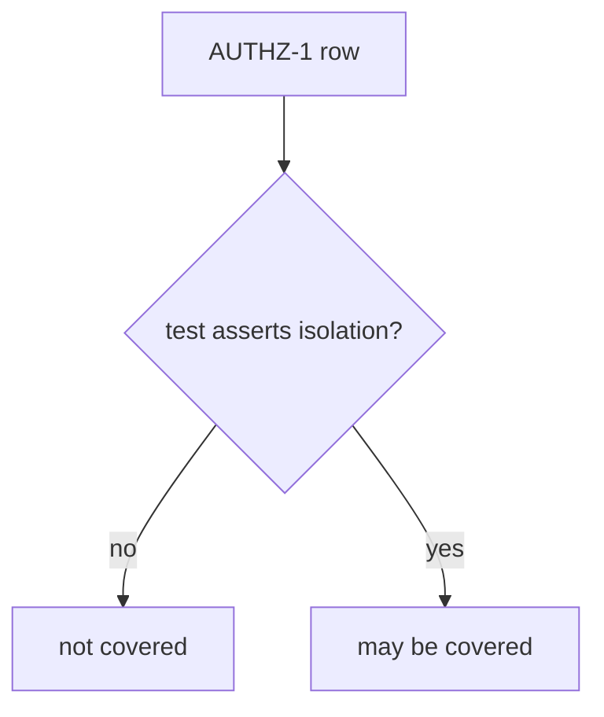
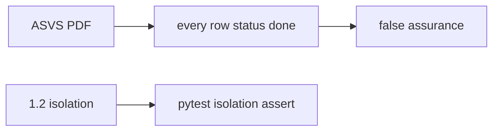

# 9.1-LO-01 — Status=done is not AUTHZ-1 coverage

**Kind:** concept-model
**Loop step:** 1 Property
**Standards:** OWASP ASVS 5.0.0 (final) `v5.0.0-8.2.1`, `v5.0.0-8.2.2`; `v5.0.0-8.3.2` is **Level 3, advanced**. NIST SSDF 1.1 (final) PW.1 / PW.8. SSDF 1.2 IPD is **draft**. MASVS 2.1.0 + MASTG 2.0.0 for mobile rows.

## The claim this module owns

SecureCollab tracks `AUTHZ-1`: a member of tenant A must not read tenant B’s note (1.2 / 4.4). A spreadsheet cell `status=done` is **not** that property. Coverage is a predicate over tests: the row must name a test that **asserts isolation**.

> `covered("AUTHZ-1", [{"req": "AUTHZ-1", "asserts_isolation": False}])` must be false.

The forbidden outcome is **status-only row counted as AUTHZ-1 coverage**. That is integrity of the assurance case — shipping 1.2 holes with a green gate.

ASVS 5.0.0 Level 2 is the normal web/API backbone. `v5.0.0-8.2.1` is function-level; `v5.0.0-8.2.2` is object-level (the AUTHZ-1 grain). `v5.0.0-8.3.2` (authorization changes applied immediately, including serializers) is **Level 3, advanced** — if you elevate it, it still needs a test, not a copied chapter. SSDF 1.1 names PW.8 (test executable code against requirements) as vocabulary, not as Gate 9.

## Mental model: coverage predicate



## Mental model: wholesale paste is not tailoring



**Mechanism (not the property):** ASVS PDF, a Jira “done” column, pytest-cov percentage, SSDF attestation.

## Root cause vs impact vs prevention vs detection vs recovery

| Slice | For this property |
|---|---|
| Root cause | Status without an isolation assert |
| Preconditions | `covered` true when `asserts_isolation` is false |
| Trigger | Release gated on the spreadsheet |
| Impact | 1.2 holes ship with a green Gate 9 sticker |
| Prevention | Coverage predicate requires the isolation assert |
| Detection | `unmapped_req_blocks_release` |
| Recovery | Add the test; do not backfill “done” |

## Framework defaults versus the coverage guarantee

CI green is not AUTHZ-1. Copied-wholesale ASVS is inventory, not a tailored matrix. Exceptions need expiry (E6) or they are silent uncovered rows.

## Mechanism limits

- A test named `test_authz` that asserts HTTP 200 is 9.3’s failure, not this predicate.
- Unmapped Level 3 risks remain if you never elevate.
- MASVS spreadsheet without a MASTG test is the same hole on mobile (8.2 STORAGE).

## Usability and accessibility

A human exception path must state what is uncovered and when it expires. Do not hide the gap behind “see PDF” (WCAG 2.2 4.1.3).

## Practice

One chain for AUTHZ-1. Then run:

```
python3 -m pytest labs/9.1/9.1-lab/tests --impl vulnerable
python3 -m pytest labs/9.1/9.1-lab/tests --impl fixed
```

The first command must fail. The second must pass.

## Transfer

MASVS-STORAGE for 8.2. Clinic HIPAA “done” column.

## Non-goals

Live ASVS portals, claiming Gate 9, weaponized scans. Gates 0–10 and M0–M5 stay **not-attempted**. Answer keys are not in this file.
