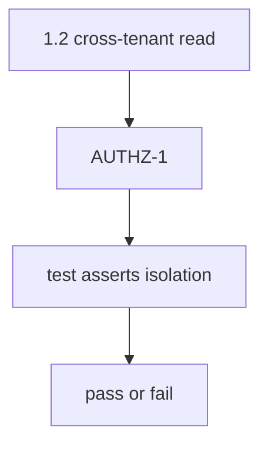
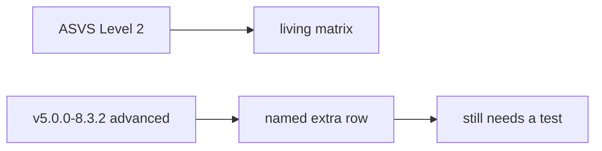

# 9.1-LO-02 — Threat to requirement to test to result

**Kind:** design-exercise
**Loop step:** 2 Model
**Standards:** OWASP ASVS 5.0.0 (final) `v5.0.0-8.2.1`, `v5.0.0-8.2.2`. NIST SSDF 1.1 PW.8.

## Can a second engineer name pytest cases from your chain?

“We imported ASVS” is not this lesson. A reviewable model names **threat, requirement id, test id, and the isolation assert**.

SecureCollab freeze: local `covered(req_id, tests)`. No live trackers.

## Mental model: the chain

## Mental model: L2 backbone vs L3 elevation

## Step 1: freeze pieces

| Piece | This system |
|---|---|
| Subjects | optimistic PM; empty CI |
| Objects | AUTHZ-1; isolation assert |
| Actions | `covered` |
| Channels | spreadsheet / CI artifact |
| TCB | coverage predicate |
| Untrusted | status column; wholesale PDF |
| State / time | exception expiry (E6) |
| 1.1 cell | integrity of the assurance case |

## Step 2: write cells

| Subject | Object | Action | Decision |
|---|---|---|---|
| status-only row | AUTHZ-1 | count as covered | deny |
| isolation assert | AUTHZ-1 | count as covered | may allow |
| wholesale ASVS paste | matrix | treat as tailored | deny |
| unnamed L3 | 8.3.2 | count as done | deny |

## Practice

Draw the chain. Point at `labs/9.1/9.1-lab` file `trace.py`.

## Transfer

MASVS-STORAGE for 8.2: same predicate, different catalogue.

## Residual risk

Unmapped Level 3; expired exceptions; 9.3 HTTP-200 tests that match the req id.

## Non-goals

Top 10 as the definition of security. Keys stay out of lessons.
