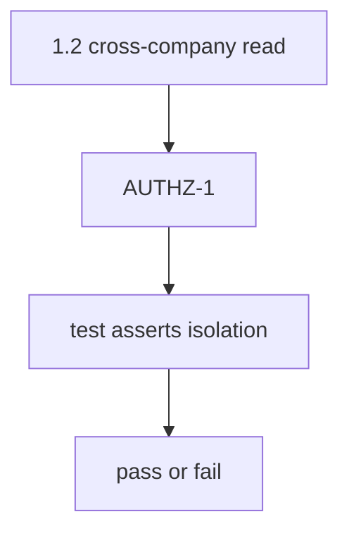
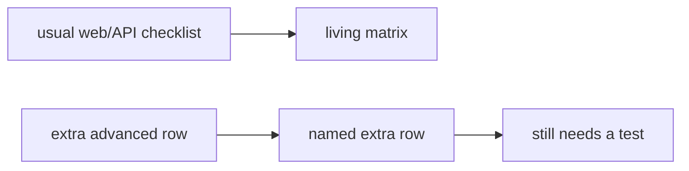

# Threat to requirement to test to result

**Kind:** design-exercise
**Loop step:** 2 Model

## Could someone else name the checks?

“We imported the checklist” is not this lesson. A drawing someone else can test names **the threat, the requirement id, the test id, and the isolation assert**.

This week’s freeze for the notes app: local `covered(req_id, tests)`. No live trackers.

> For AUTHZ-1, a status-only row is deny. A row that asserts isolation may count. Evidence that the deny is false: `covered("AUTHZ-1", [{"req": "AUTHZ-1", "asserts_isolation": False}])` returns true.

If the threat × test row is blank, the checkbox looks finished because nobody named the check.

## Picture: the chain

## Picture: the usual backbone vs an extra advanced row

The usual checklist is the living matrix. An extra advanced row is still a named row that needs a test. Pasting the whole PDF is not that picture.

## Step 1: name the pieces

Do not invent a new catalogue. Take the isolation rule you already have and ask which test would show it is false.

| Piece | This system |
|---|---|
| Who | Optimistic project manager; empty CI |
| What | AUTHZ-1; isolation assert |
| Actions | `covered` |
| Paths | Spreadsheet / CI artifact |
| What you trust for this journey | The coverage check |
| What you do not trust | The status column; a wholesale PDF |
| Time | Exception expiry (E6) |
| The rule | Honesty of the proof you show before a release |

## Step 2: write allow and deny

| Who | What | Action | Decision |
|---|---|---|---|
| Status-only row | AUTHZ-1 | count as covered | deny |
| Isolation assert | AUTHZ-1 | count as covered | may allow |
| Wholesale checklist paste | matrix | treat as tailored | deny |
| Unnamed extra advanced row | permission-change-immediate | count as done | deny |

A missing isolation-assert cell is how a done checkbox becomes false comfort. Write the hole.

## Practice

Draw the chain so someone else could name the checks. Point at `labs/9.1/9.1-lab` file `trace.py`.

## Use it somewhere new

The mobile storage row from 8.2: same check, different catalogue.

## What can still go wrong

Unmapped extra advanced rows. Expired exceptions. HTTP-200 tests that match the requirement id (9.3).

## What this page is not doing

Do not define security as a famous-bugs list. Answer keys stay out of lessons.
