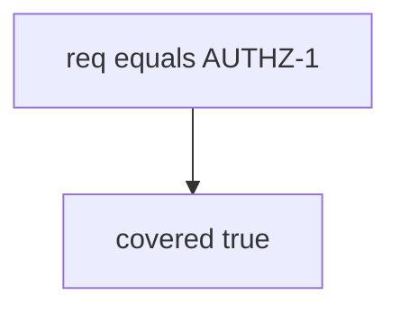

# Practice: a status-only row counted as coverage

**Kind:** mechanism-lab
**Loop step:** 3 Break

## Try it

The practice is not a website you attack. `covered(req_id, tests)` is a tiny Python helper that returns true or false. The failure is already in the function: any matching requirement id counts as coverage. That is a **failed rule**, not a missing spreadsheet cell.

> A status-only AUTHZ-1 row must not count as coverage. If `covered("AUTHZ-1", [{"req": "AUTHZ-1", "asserts_isolation": False}])` is true, the proof you show before a release has failed as a security control.

## Where you may practice

Stay inside `labs/9.1/9.1-lab` — in-process `covered(req_id, tests)`. The requirement id is the synthetic string `AUTHZ-1`. No live checklist portals, no governance products, no clinic systems. Do not send the spreadsheet anywhere.

Do not paste a real requirements matrix into a public tracker “to see what happens.” Do not paste this exercise onto a public checklist portal, employer dashboard, or live clinic.

What is supposed to stop this: `covered` is supposed to be a **check over tests that assert isolation**. Checklist membership, pytest-cov, and a practice-guide attestation are not enough.

Who can mark the row done in this story: an optimistic status column. That stands in for “we imported the PDF and marked isolation done,” a tracker Done column, or a mobile storage spreadsheet checkbox without a matching test.

## Picture: matching the id is enough



You do not need CI. You must not call a live checklist portal. The true return *is* the leak of honesty.

The isolation lessons (1.2 / 4.4) already refused company B reading company A. This check is **whether the proof names a test that asserts that**. A pasted PDF is inventory. It does not assert isolation.

## What to look at: the cause, not a hunt

`vulnerable/trace.py` returns true if any test dict has `req == req_id`. Tests:

- `test_status_only_row_is_not_coverage`
- `test_isolation_assert_may_count_as_coverage` — an honest isolation flag may pass on both

You do not need a new requirement id.

| What you see | What kind of failure | Not the lesson |
|---|---|---|
| `req == req_id` is enough | Status / membership without an isolation assert | “We imported the PDF” |
| `covered` true when `asserts_isolation` is false | A done checkbox used as the payload | A green CI job |
| No isolation flag required | The sink accepted membership | “We use pytest-cov” |

## Why it happens vs what it costs

| Slice | Practice |
|---|---|
| The rule | Status-only row → `covered` false |
| Why it happens | Status / membership without an isolation assert |
| What has to be true first | `covered` is true when `asserts_isolation` is false |
| Trigger | Release gated on the spreadsheet |
| What it costs | 1.2 holes ship with a green verification sticker |
| How you stop it later | Coverage requires the isolation assert |
| How you notice later | `unmapped_req_blocks_release`; never note bodies |
| How you recover later | Add the test; do not backfill “done” |
| Out of scope | A checklist PDF page, a live portal, or claiming the verification gate |

A green CI job is not AUTHZ-1. Copied-wholesale checklists are inventory, not a tailored matrix. A FastAPI TestClient 200 is a product test (9.3). Status-only is not covered.

## Practice

```text
python3 -m pytest labs/9.1/9.1-lab/tests --impl vulnerable
```

Run from `labs/9.1/9.1-lab` if a collection at the repo root picks up `site/`. Do not probe public hosts. A setup error is not proof the rule holds.

## Use it somewhere new

A clinic example: predict a HIPAA “done” column with no isolation test — still only this directory. Do not scrape a live governance product.

## What this page is not doing

No live-target steps. Fake `AUTHZ-1` only. Do not dump real people’s data into the practice files. Do not “fix” the practice by deleting the test.
