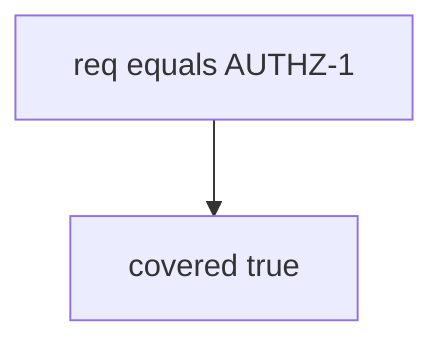

# 9.1-LO-03 — Observe any-req-match counted as coverage

**Kind:** mechanism-lab
**Loop step:** 3 Break
**Standards:** OWASP ASVS 5.0.0 (final) `v5.0.0-8.2.1`. Object-level isolation is `v5.0.0-8.2.2` (4.4). `v5.0.0-8.3.2` is **Level 3, advanced**. NIST SSDF 1.1 (final) PW.8. SSDF 1.2 IPD is **draft**.

## Authorized scope

`labs/9.1/9.1-lab` only. The fixture is an in-process `covered(req_id, tests)`. Synthetic requirement id `AUTHZ-1`. No live ASVS portals, GRC products, or clinic systems.

**Forbidden outcome:** Status-only row counted as AUTHZ-1 coverage. `covered("AUTHZ-1", [{"req": "AUTHZ-1", "asserts_isolation": False}])` returns true.

Attacker capability in this lab: an optimistic status column. That stands in for “we imported the ASVS PDF and marked isolation done,” a Jira Done column, or a MASVS spreadsheet checkbox without a MASTG test. Trust assumption: `covered` is supposed to be a **predicate over tests that assert isolation**. Checklist membership, pytest-cov, and SSDF attestation are not in the TCB for this cell.

## Mental model: membership is enough



The vulnerable tree demonstrates **cause** (any matching req id counts). Do not scrape public checklists. Preconditions: `covered` returns true if any test dict has `req == req_id`. You do not need CI. You must not call an ASVS portal.

ASVS 5.0.0 Level 2 is the normal web/API backbone. `v5.0.0-8.2.1` is function-level; AUTHZ-1’s grain is object isolation (`v5.0.0-8.2.2` / 4.4). A green matrix over a missing 1.2 test is false assurance of Gate 9 — and Gate 9 stays **not-attempted**.

## What to read in the fixture

`vulnerable/trace.py` returns true if any test dict has `req == req_id`. Tests:

- `test_status_only_row_is_not_coverage`
- `test_isolation_assert_may_count_as_coverage` — honest isolation flag may pass on both

You do not need a new requirement id. The failure of `test_status_only_row_is_not_coverage` *is* the evidence.

Do not open the fixed tree yet. Diagnose the cause first.

## Root cause vs impact vs prevention vs detection vs recovery

| Slice | This lab |
|---|---|
| Required property | Status-only row → `covered` false |
| Root cause | Status / membership without an isolation assert |
| Preconditions | `covered` true when `asserts_isolation` is false |
| Trigger | Release gated on the spreadsheet |
| Impact | 1.2 holes ship with a green Gate 9 sticker |
| Prevention | Coverage predicate requires the isolation assert |
| Detection | `unmapped_req_blocks_release`; never note bodies |
| Recovery | Add the test; do not backfill “done” |
| Not the lesson | An ASVS PDF page; live portal; Gate 9 complete |

## Framework defaults versus the coverage guarantee

CI green is not AUTHZ-1. Copied-wholesale ASVS is inventory, not a tailored matrix. FastAPI TestClient 200 is a product test (9.3). The application guarantee is: **this** fixture, status-only is not covered.

## Practice

```text
python3 -m pytest labs/9.1/9.1-lab/tests --impl vulnerable
```

Run from `labs/9.1/9.1-lab` if a repo-root collection picks up `site/`. Record `test_status_only_row_is_not_coverage`. Do not probe public hosts. An environment error is not security evidence.

## Transfer

Clinic HIPAA “done” column: predict without leaving this directory. Do not scrape a live GRC.

## Non-goals

No live-target or scanner-dump instructions. Do not claim Gate 9. SSDF 1.2 IPD stays labeled draft.
