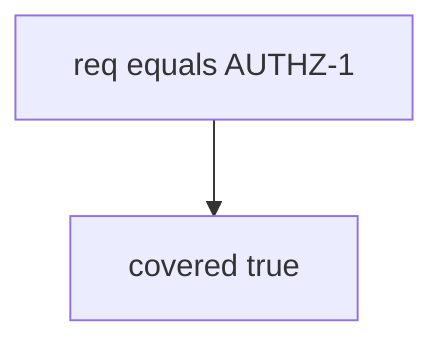

# 9.1-LO-03 — Observe any-req-match counted as coverage

**Kind:** mechanism-lab
**Loop step:** 3 Break
**Standards:** OWASP ASVS 5.0.0 (final) `v5.0.0-8.2.1`.

## Authorized scope

`labs/9.1/9.1-lab` only. Synthetic requirement id `AUTHZ-1`. No live ASVS portals or clinic systems.

**Forbidden outcome:** Status-only row counted as AUTHZ-1 coverage.

## Mental model: membership is enough



The vulnerable tree demonstrates **cause** (any matching req id counts). Do not scrape public checklists.

## What to read in the fixture

`vulnerable/trace.py` returns true if any test dict has `req == req_id`. Tests require a status-only row (`asserts_isolation: False`) to be false.

## Root cause vs impact

| Slice | Lab |
|---|---|
| Root cause | Status / membership without an isolation assert |
| Impact | Green matrix over a missing 1.2 test |
| Not the lesson | An ASVS PDF page as the definition |

## Practice

```
python3 -m pytest labs/9.1/9.1-lab/tests --impl vulnerable
```

Record `test_status_only_row_is_not_coverage`. Do not probe public hosts.

## Transfer

Clinic HIPAA “done” column: predict without leaving this directory.

## Non-goals

No live-target or scanner-dump instructions.
