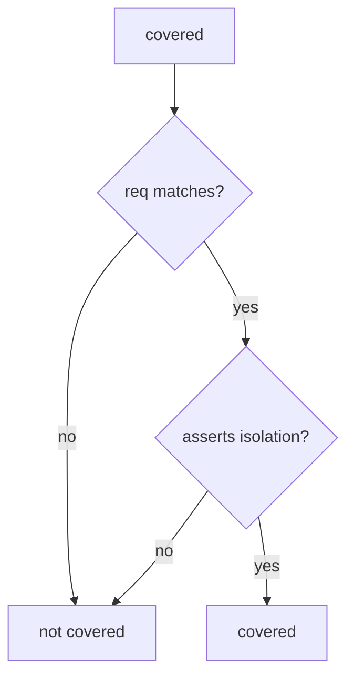

# 9.1-LO-04 — Coverage requires an isolation assert

**Kind:** design-exercise
**Loop step:** 4 Build
**Standards:** OWASP ASVS 5.0.0 (final) `v5.0.0-8.2.1`, `v5.0.0-8.2.2`. NIST SSDF 1.1 PW.8.

## Structural means the predicate checks the assert

`covered` must require `req == req_id` **and** `asserts_isolation`. A row that only stores status is uncovered. Fail-safe: missing flag is false.

## Mental model: both gates



Do not accept “we ran ASVS” as the isolation flag.

## Why this restores the cell

| After the fix | Must be true |
|---|---|
| status-only row | `covered` false |
| isolation-assert row | `covered` true |
| empty list | `covered` false |

## What this is not

pytest-cov. Jira done. Copied-wholesale ASVS. SSDF 1.2 IPD (draft) as a sticker.

## Practice

Name the predicate. Run:

```
python3 -m pytest labs/9.1/9.1-lab/tests --impl fixed
```

Must pass.

## Transfer

MASVS-STORAGE: require a MASTG test id, not a control-group checkbox.

## Residual risk

HTTP-200 tests that set `asserts_isolation` by mistake (9.3); unnamed Level 3; exceptions without expiry (E6).
