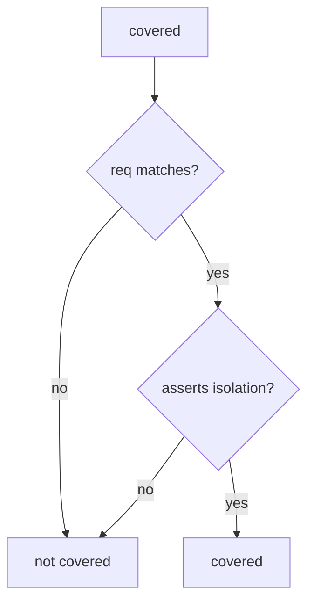

# Coverage requires an isolation assert

**Kind:** design-exercise
**Loop step:** 4 Build

## The rule

The old spreadsheet cells are not an isolation assert. A silenced finding does not cover `AUTHZ-1`. Running the checklist once does not finish this.

What has to change: `covered` **requires `req == req_id` and `asserts_isolation`**. A row that only stores status is uncovered. Namely that conjunction — not “we ran the checklist,” not pytest-cov, not a tracker Done column.

The notes app’s AUTHZ-1 tracking needs this: status-only → not covered. A missing flag is false. Don't waive the deny just because the PDF was attached. Don't take “we ran the checklist” as the isolation flag.

## Picture: coverage and isolation are both gates



Status and an isolation test both have to be present. A flag `asserts_isolation` on an HTTP-200-only test is a lying flag (9.3). Extra advanced rows stay unmapped if you never raise them. Mobile storage without a matching test is the same hole on a phone (8.2). Exceptions need an expiry date (E6) or they are silent uncovered rows.

A development-practice guide that wants executable tests against requirements covers AUTHZ-1 status-only. The check is the local stand-in.

## What the repaired files must show

Do not treat `fixed/trace.py` as a production governance product.

| After the fix | Must be true |
|---|---|
| status-only row | `covered` false |
| isolation-assert row | `covered` true |
| empty list | `covered` false |

If you are unsure whether a test asserts isolation, it does not count. Attaching the PDF does not turn it into coverage.

## What this is not

- pytest-cov.
- A tracker done column.
- Copied-wholesale checklists.
- A later draft of a practice guide used as a sticker.
- The verification gate complete.
- A test named `test_authz` that asserts HTTP 200 (9.3).

## What the tool cannot do

- A test named `test_authz` that asserts HTTP 200 is a later failure (9.3), not this check.
- Extra advanced rows stay unmapped if you never elevate them.
- A mobile storage spreadsheet without a matching test is the same hole on a phone (8.2).
- Exceptions without expiry (E6) are silent uncovered rows.

## Can people still use it

A human exception path must say what is still uncovered and when it expires. A scan attachment is not the uncovered-row text.

## Practice

Name the check (`req` matches **and** `asserts_isolation`). Run:

```text
python3 -m pytest labs/9.1/9.1-lab/tests --impl fixed
```

## Use it somewhere new

Mobile storage (8.2): require a matching test id, not a control-group checkbox.

## What can still go wrong

HTTP-200 tests that set `asserts_isolation` by mistake (9.3). Unnamed extra advanced rows. Exceptions without expiry (E6).
