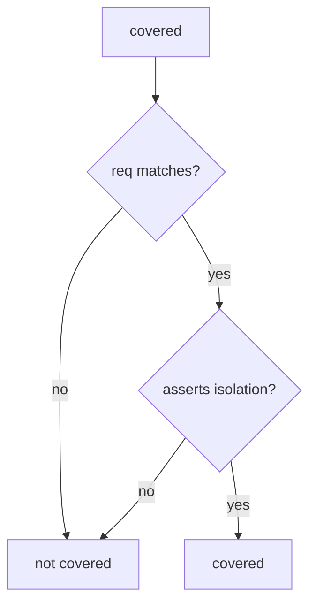

# 9.1-LO-04 — Coverage requires an isolation assert

**Kind:** design-exercise
**Loop step:** 4 Build
**Standards:** OWASP ASVS 5.0.0 (final) `v5.0.0-8.2.1`, `v5.0.0-8.2.2`. NIST SSDF 1.1 (final) PW.8. `v5.0.0-8.3.2` is **Level 3, advanced**. SSDF 1.2 IPD is **draft**.

## Structural means the predicate checks the assert

`covered` must require `req == req_id` **and** `asserts_isolation`. A row that only stores status is uncovered. Structural means that conjunction — not “we ran ASVS,” not pytest-cov, not Jira Done.

The smallest restore for SecureCollab AUTHZ-1 tracking is: status-only → not covered. Fail-safe: missing flag is false. Do not fail open because the PDF was attached. Do not accept “we ran ASVS” as the isolation flag.

## Mental model: coverage and test both gates



The lab’s fixed tree requires both gates. Production still needs 9.3’s *shape*: a test that sets `asserts_isolation` while only checking HTTP 200 is a lying flag. Unmapped Level 3 (`v5.0.0-8.3.2`) remains if you never elevate it. MASVS-STORAGE without a MASTG test is the same hole on mobile (8.2). Exceptions need expiry (E6) or they are silent uncovered rows.

SSDF 1.1 PW.8 wants executable tests against requirements. This pytest is that sentence for AUTHZ-1 status-only.

## Why this restores the cell

| After the fix | Must be true |
|---|---|
| status-only row | `covered` false |
| isolation-assert row | `covered` true |
| empty list | `covered` false |

## What this is not

pytest-cov. Jira done. Copied-wholesale ASVS. SSDF 1.2 IPD (draft) as a sticker. Gate 9 complete. A test named `test_authz` that asserts HTTP 200 (9.3).

## Mechanism limits

- A test named `test_authz` that asserts HTTP 200 is 9.3’s failure, not this predicate.
- Unmapped Level 3 risks remain if you never elevate (`v5.0.0-8.3.2`).
- MASVS spreadsheet without a MASTG test is the same hole on mobile (8.2 STORAGE).
- Exceptions without expiry (E6) are silent uncovered rows.

## Practice

Name the predicate (`req` matches **and** `asserts_isolation`). Run:

```text
python3 -m pytest labs/9.1/9.1-lab/tests --impl fixed
```

Must pass. Run from the lab directory if collection at repo root is polluted.

## Transfer

MASVS-STORAGE: require a MASTG test id, not a control-group checkbox.

## Residual risk

HTTP-200 tests that set `asserts_isolation` by mistake (9.3); unnamed Level 3; exceptions without expiry (E6).

## Non-goals

Do not call a live ASVS portal. Do not claim Gate 9 from a PDF screenshot. Do not present SSDF 1.2 IPD as final.
