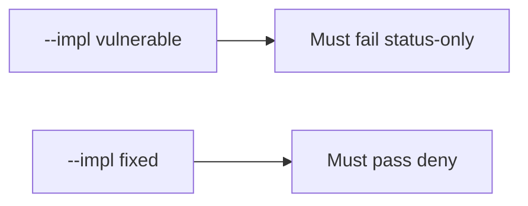

# 9.1-LO-05 — Evidence is status-only denied, then a passing pair

**Kind:** verification-lab
**Loop step:** 5 Verify
**Standards:** OWASP ASVS 5.0.0 (final) `v5.0.0-8.2.1`.

## An invariant that cannot fail a test is still a slogan

“Matrix imported” is not evidence. “CI is green” is a mechanism observation. The oracle is: `covered("AUTHZ-1", [status-only])` is false and `covered("AUTHZ-1", [isolation assert])` may be true. The status-only observation must be **false** on `--impl vulnerable` (returns true) and **true** on `--impl fixed`. Do not call an ASVS portal.

## Mental model: vulnerable must fail: status-only

The failing observation on `--impl vulnerable` is **status-only**. A passing collection count is not this cell.



| Mode | Must show for this module |
|---|---|
| Negative / abuse | status-only → not covered; vulnerable must fail |
| Normal | isolation assert → covered (may pass on both) |
| Not claimed | real ASVS assessment; Gate 9; SSDF 1.2; that the named test actually isolates |

Lab tests in `labs/9.1/9.1-lab/tests/test_property.py`. `test_status_only_row_is_not_coverage` is a **forbidden-outcome** test: membership without an isolation assert is not allowed to count as coverage.

```text
python3 -m pytest labs/9.1/9.1-lab/tests --impl vulnerable
python3 -m pytest labs/9.1/9.1-lab/tests --impl fixed
```

Honest isolation-assert rows may pass on both implementations. That does not excuse the status-only deny test. If vulnerable does not fail `test_status_only_row_is_not_coverage`, the lab is miswired—fix the wiring, not the assertion.

## What the tests do not prove

- That the named test actually isolates tenants (9.3 owns shape)
- That Level 3 `v5.0.0-8.3.2` is covered
- MASVS-STORAGE on a device
- SSDF 1.2 IPD (draft) as a product
- Gate 9 complete

Record those as residuals or later modules, not as silent passes.

## Practice

Execute both implementations this session from the lab directory if needed. Write the fail/pass pair next to the matrix row. Reject a “test” that only greps `AUTHZ-1` in a spreadsheet without calling `covered(..., [{"asserts_isolation": False}])`.

## Transfer

Clinic: a test that only asserts the spreadsheet exports is not this cell. A live GRC scrape is out of scope.

## Non-goals

Do not add a live ASVS trophy. Do not log note bodies. Keys stay out of this file. Gate 9 stays not-attempted.
