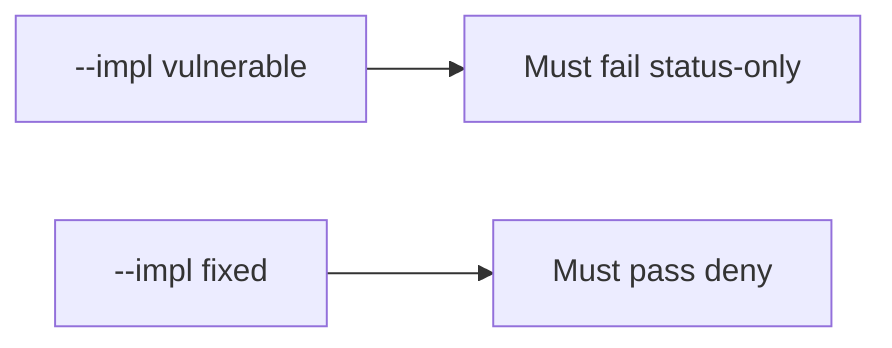

# 9.1-LO-05 — Evidence is status-only denied, then a passing pair

**Kind:** verification-lab
**Loop step:** 5 Verify
**Standards:** OWASP ASVS 5.0.0 (final) `v5.0.0-8.2.1`.

## An invariant that cannot fail a test is still a slogan

“Matrix imported” is not evidence. The oracle is the local pair. Do not call an ASVS portal.

## Mental model: fail-on-vulnerable, pass-on-fixed



| Case | Must show |
|---|---|
| Negative / abuse | status-only → not covered |
| Normal | isolation assert → covered |
| Not claimed | real ASVS assessment; Gate 9; SSDF 1.2 |

```
python3 -m pytest labs/9.1/9.1-lab/tests --impl vulnerable
python3 -m pytest labs/9.1/9.1-lab/tests --impl fixed
```

Honest isolation-assert rows may pass on both.

## What the tests do not prove

- That the named test actually isolates tenants (9.3 owns shape)
- That Level 3 `v5.0.0-8.3.2` is covered
- MASVS-STORAGE on a device

## Practice

Execute both implementations. Map each test to an LO-02 cell.

## Transfer

Clinic: a test that only asserts the spreadsheet exports is not this cell.
