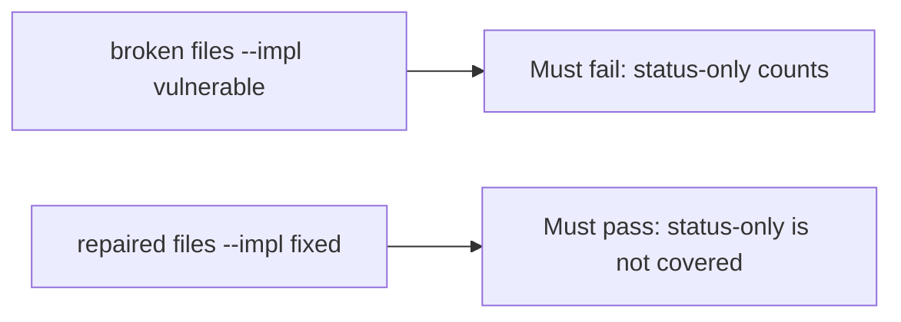

# A broken coverage check must fail the status-only test

**Kind:** verification-lab
**Loop step:** 5 Verify

## If you cannot test it, it is still a slogan

“Matrix imported” is not evidence. “CI is green” is a tool observation. The check is: `covered("AUTHZ-1", [status-only])` is false and `covered("AUTHZ-1", [isolation assert])` may be true. That status-only observation must be **false** on the broken files and **true** on the repaired files. Do not call a live checklist portal.

## Picture: a broken coverage check must fail the status-only test

A test that only counts passing tests can pass while a status-only row still counts as coverage. Ask whether membership without an isolation assert still counts as a pass. The broken files must fail that. The repaired files must pass it.



If both pass, the test is not looking at `asserts_isolation`. If both fail, the fix is not structural or the check is wrong.

## Four modes, even for a coverage dict

| Mode | Must show for this topic |
|---|---|
| Normal | Isolation assert → covered (may pass on both) |
| Wrong input | status-only → not covered; broken files must fail |
| Abuse | Unsure flags are not coverage (fail closed; leftover if not in this check) |
| Not claimed | A real checklist assessment; the verification gate; a later draft of a practice guide; that the named test actually isolates |

The file is `labs/9.1/9.1-lab/tests/test_property.py`. The test `test_status_only_row_is_not_coverage` is a **what must not happen** test: membership without an isolation assert is not allowed to count as coverage.

Honest isolation-assert rows may pass on both implementations. That does not excuse the status-only deny test. If the broken files do not fail `test_status_only_row_is_not_coverage`, the lab is miswired — fix the wiring, not the assertion.

```text
python3 -m pytest labs/9.1/9.1-lab/tests --impl vulnerable
python3 -m pytest labs/9.1/9.1-lab/tests --impl fixed
```

A test that only greps `AUTHZ-1` in a spreadsheet without calling `covered(..., [{"asserts_isolation": False}])` is not this topic’s evidence. This practice never opens a live checklist portal.

## What the tests do not prove

- That the named test actually isolates companies (9.3 owns shape)
- That an extra advanced row is covered
- Mobile storage on a device (8.2)
- A later draft of a practice guide as a product
- The verification gate complete

Record those as leftover or later topics, not as silent passes.

## Practice

Run both this session from the lab directory if needed:

```text
python3 -m pytest labs/9.1/9.1-lab/tests --impl vulnerable
python3 -m pytest labs/9.1/9.1-lab/tests --impl fixed
```

Paste nothing from answer keys. Write fail/pass into your notes next to the AUTHZ-1 row. Reject a “test” that only greps `AUTHZ-1` in a spreadsheet without calling `covered(..., [{"asserts_isolation": False}])`.

## Use it somewhere new

A clinic example: a test that only asserts the spreadsheet exports is not this topic. A live governance scrape is out of scope.

## What this page is not doing

Do not treat a live checklist screenshot as proof. Do not log note bodies. Answer keys are not on this site. This page does not finish the verification check-in.
