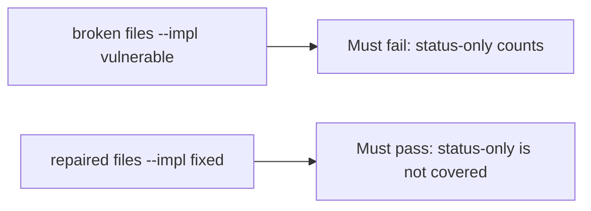

# A broken coverage check must fail the status-only test

**Kind:** verification-lab
**Loop step:** 5 Verify

## Check it

Importing a matrix spreadsheet does not prove `AUTHZ-1` has an isolation assert. A green CI tile is a score. `covered("AUTHZ-1", [status-only])` has to be false, and `covered("AUTHZ-1", [isolation assert])` may be true. On the broken files status-only still counts. On the repaired files it does not. Do not call a live checklist portal.

## Picture: a broken coverage check must fail the status-only test

A passing-test tally can still hide that a status-only row still counts as coverage.



If both pass, you are not looking at `asserts_isolation`.

## What the check has to show

| Mode | Must show for this topic |
|---|---|
| Normal | Isolation assert → covered (may pass on both) |
| Wrong input | status-only → not covered; broken files must fail |
| Abuse | Unsure flags are not coverage (fail closed; leftover if not in this check) |
| Not claimed | A real checklist assessment; the verification gate; a later draft of a practice guide; that the named test actually isolates |

The test `test_status_only_row_is_not_coverage` is there so membership without an isolation assert cannot count as coverage.

A row that actually asserts isolation may pass on both sides. You still have to deny a status-only row. If the broken files do not fail `test_status_only_row_is_not_coverage`, the lab is miswired — fix the wiring, not the assertion.

```text
python3 -m pytest labs/9.1/9.1-lab/tests --impl vulnerable
python3 -m pytest labs/9.1/9.1-lab/tests --impl fixed
```

An `AUTHZ-1` cell is not `covered(..., [{"asserts_isolation": False}])`. This practice never opens a live checklist portal.

## What the tests do not prove

- That the named test actually isolates companies (9.3 owns shape)
- That an extra advanced row is covered
- Mobile storage on a device (8.2)
- A later draft of a practice guide as a product
- The verification gate complete

## Practice

Call `covered(..., [{"asserts_isolation": False}])`. An `AUTHZ-1` cell is the row id, not the isolation flag.

## Use it somewhere new

A spreadsheet that exports is a file, not `covered` with isolation. Do not run a live governance scrape.

## What this page is not doing

A live checklist screenshot is not `covered` with isolation. Do not log note bodies. Answer keys are not on this site. This page does not finish the verification check-in.
