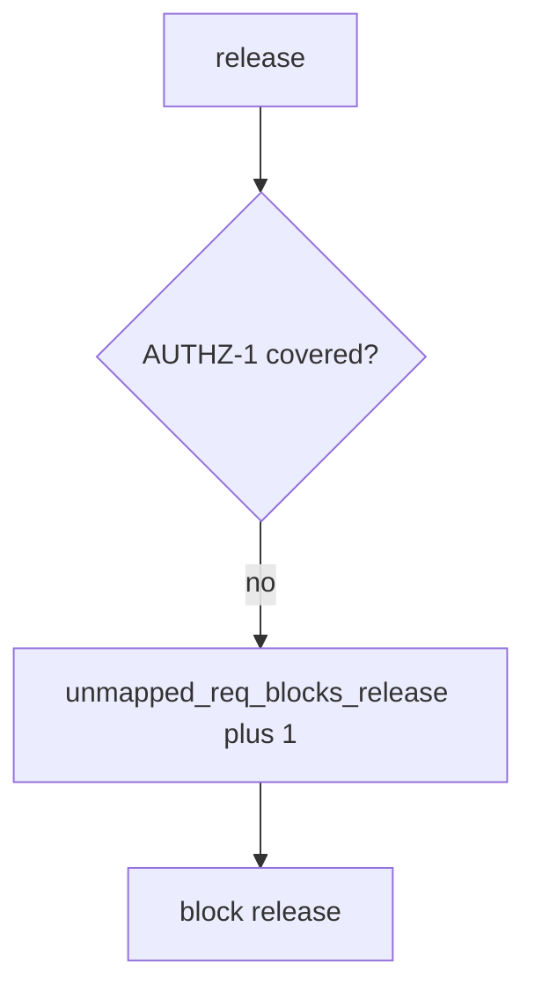

# Block the release without logging notes

**Kind:** operations-exercise
**Loop step:** 6 Operate

## Fixing it once is not enough

A new requirement can land with no isolation test attached. Skip failing-test note bodies, company dumps, and patient rows in the ticket.

## Picture: uncovered AUTHZ-1 is a signal

If a requirement has no isolation test, page the requirement id — not the requirement text. Then add the isolation test.



Importing a governance catalog does not attach an isolation test to AUTHZ-1.

A status-only row with no isolation test still has to fail `test_status_only_row_is_not_coverage`. Importing a checklist does not attach an isolation test. Mobile storage rows (8.2) still need an isolation test; a checklist tick does not cover AUTHZ-1. A 200-only test that someone flagged `asserts_isolation` by mistake is a later lying-flag leftover (9.3), not a silent pass.

## Signals that do not become a second leak

| Outcome | This topic |
|---|---|
| Notice | `unmapped_req_blocks_release` |
| What the line holds | Requirement id, missing test id; **never** bodies |
| Respond | Stop the release that would ship the hole; do not paste note bodies into chat |
| Recover | Add the isolation test; do not backfill done |
| Leftover | Unnamed extra advanced rows; exceptions (E6); 9.3 lying flags |

A tracker dashboard will show Done and stay silent when AUTHZ-1 still has `asserts_isolation: False`. Detection must observe **status-only is not covered**, not issue count. If the alert includes note bodies from the isolation test, you have opened the same leak as a log line (3.1).

```text
log_denied reason=unmapped_req_blocks_release req=AUTHZ-1 release=rel_91e
```

The requirement example leaks from a sample that still has a note body, a patient name, or a live checklist portal trace.

A matching note in the coverage alert already puts the requirement example in the pager.

## What the framework does vs what you still have to check

HTTP-200 tests, unnamed extra rows, and expired exceptions still look Done without an isolation test.

## Can people still use it

A human exception path must say what is still uncovered and when it expires. An unmapped-requirement badge still has to be words, not a PDF shrug. If operators see an unmapped-requirement badge, do not encode it as color only.

## Practice

```text
log_denied reason=unmapped_req_blocks_release req=AUTHZ-1 release=rel_91e
```

A note body, a live checklist portal trace, or “verification gate complete” should stay off this coverage line.

## Use it somewhere new

Block a release when the HIPAA “done” column has no isolation test; do not attach patient rows to the ticket. Do not scrape a live governance product.

## What this page is not doing

Do not use live portal traces. This page does not finish the verification check-in. Answer keys are not on this site.
