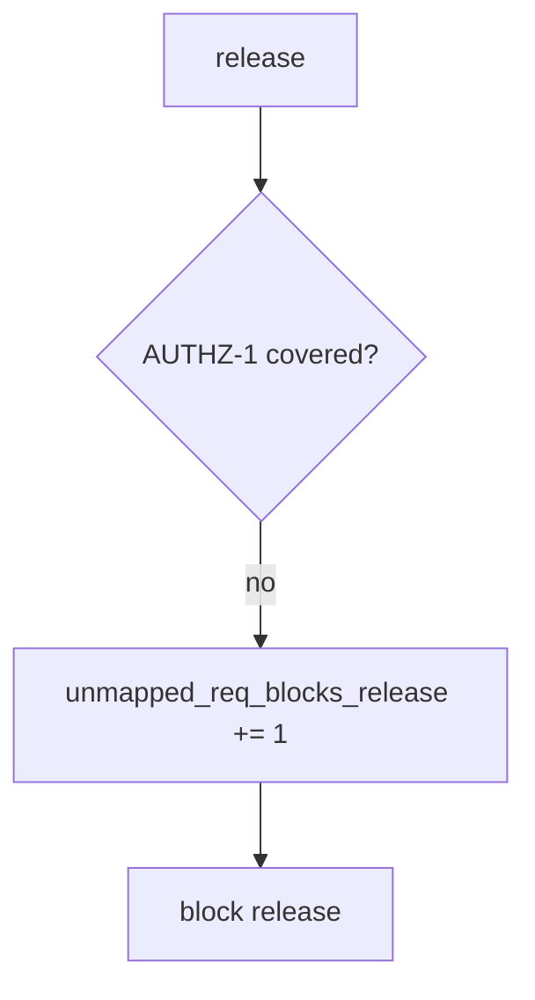

# 9.1-LO-06 — Detect unmapped_req_blocks_release without logging bodies

**Kind:** operations-exercise
**Loop step:** 6 Operate
**Standards:** NIST CSF 2.0 (final) DE/RS/RC as outcome labels; NIST SSDF 1.1 PW.8.

## Prevention is not absolute

A new requirement can land without a test. Pair detect and recover. Do not log note bodies or tenant dumps from the failing test (3.1).

## Mental model: uncovered AUTHZ-1 is a signal



| Outcome | This module |
|---|---|
| Detect | `unmapped_req_blocks_release` |
| Signal | req id, test id missing; never bodies |
| Recover | Add the isolation test; do not backfill done |
| Residual | Unnamed Level 3; exceptions (E6) |

## Practice

Write one log line you would accept. Tie it to `labs/9.1/9.1-lab`.

```
log_denied reason=unmapped_req_blocks_release req=AUTHZ-1 release=rel_91e
```

Reject any line that includes a note body, a live ASVS portal trace, or “Gate 9 complete.”

## Transfer

Clinic: block a release when the HIPAA “done” column has no isolation test; do not attach patient rows to the ticket.

## Non-goals

A GRC product name is not the property. Gate 9 stays not-attempted.
