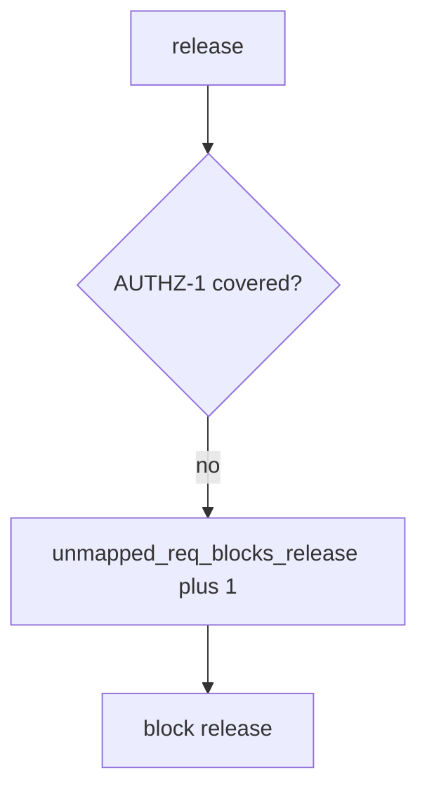

# 9.1-LO-06 — Detect unmapped_req_blocks_release without logging bodies

**Kind:** operations-exercise
**Loop step:** 6 Operate
**Standards:** NIST CSF 2.0 (final) DE/RS/RC as outcome labels; NIST SSDF 1.1 (final) PW.8. ASVS 5.0.0 (final) `v5.0.0-8.2.1`. SSDF 1.2 IPD is **draft**.

## Prevention is not absolute

A new requirement can land without a test after `covered` was “fixed once.” Pair detect and recover. Do not log note bodies or tenant dumps from the failing test (3.1). Do not attach patient rows to the ticket.

## Mental model: uncovered AUTHZ-1 is a signal



| Outcome | This module |
|---|---|
| Detect | `unmapped_req_blocks_release` |
| Signal | req id, test id missing; never bodies |
| Recover | Add the isolation test; do not backfill done |
| Residual | Unnamed Level 3; exceptions (E6); 9.3 lying flags |

CSF 2.0 Detect / Respond / Recover name outcomes. They do not prove PW.8. A GRC product name is not the property. Re-run `test_status_only_row_is_not_coverage` after any matrix change; a green “ASVS imported” tile is not that pytest. MASVS-STORAGE rows (8.2) are other requirements of the same predicate — inventory them before claiming Recover. A 200-only test that someone flagged `asserts_isolation` by mistake is a 9.3 lying-flag residual, not a silent pass.

## Framework defaults versus the operate guarantee

A Jira dashboard will show Done and stay silent when AUTHZ-1 still has `asserts_isolation: False`. Detection must observe **status-only is not covered**, not issue count. If the alert includes note bodies from the isolation test, you have opened a 3.1 cell.

## Practice

Write one log line you would accept. Tie it to `labs/9.1/9.1-lab`.

```text
log_denied reason=unmapped_req_blocks_release req=AUTHZ-1 release=rel_91e
```

Reject any line that includes a note body, a live ASVS portal trace, or “Gate 9 complete.”

## Transfer

Clinic: block a release when the HIPAA “done” column has no isolation test; do not attach patient rows to the ticket. Do not scrape a live GRC.

## Usability

A human exception path must state what is uncovered and when it expires (WCAG 2.2 Success Criterion 4.1.3). Do not hide the gap behind “see PDF.”

## Non-goals

A GRC product name is not the property. Gate 9 stays not-attempted.
