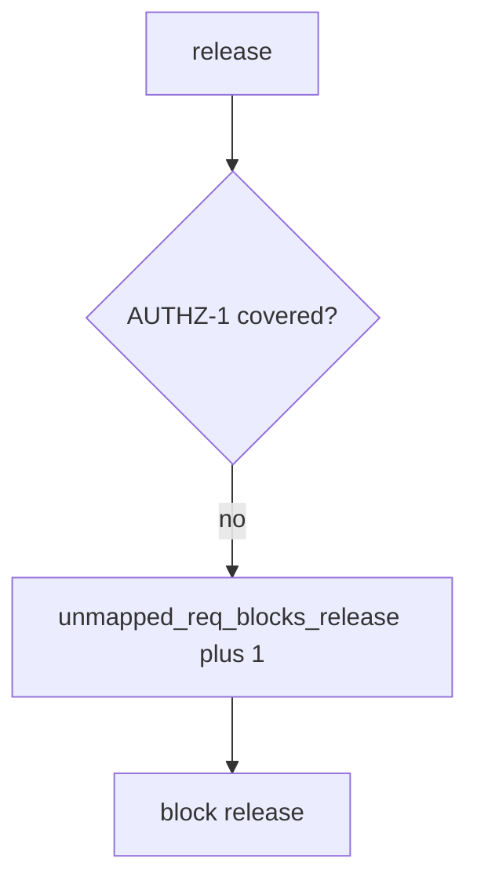

# unmapped_req_blocks_release without logging bodies

**Kind:** operations-exercise
**Loop step:** 6 Operate

## Stopping it is not enough

A new requirement can land without a test after `covered` was “fixed once.” Pair notice and recover. Do not log note bodies or company dumps from the failing test (3.1). Do not attach patient rows to the ticket.

## Picture: uncovered AUTHZ-1 is a signal

An unmapped requirement is a notice-and-recover problem, not a licence to quote the note in the paging channel. Notice names the requirement. Recover adds the isolation test. Neither reprints the body.



Industry lists talk about noticing, responding, and recovering. They do not pick a governance product. They do not prove this requirement is covered. Someone still has to own the leftover.

Re-run `test_status_only_row_is_not_coverage` after any matrix change. A green “checklist imported” tile is not that check. Mobile storage rows (8.2) are other requirements of the same check — inventory them before you claim recover. A 200-only test that someone flagged `asserts_isolation` by mistake is a later lying-flag leftover (9.3), not a silent pass.

## Signals that do not become a second leak

| Outcome | This topic |
|---|---|
| Notice | `unmapped_req_blocks_release` |
| What the line holds | Requirement id, missing test id; **never** bodies |
| Respond | Stop the release that would ship the hole; do not paste note bodies into chat |
| Recover | Add the isolation test; do not backfill done |
| Leftover | Unnamed extra advanced rows; exceptions (E6); 9.3 lying flags |

A tracker dashboard will show Done and stay silent when AUTHZ-1 still has `asserts_isolation: False`. Detection must observe **status-only is not covered**, not issue count. If the alert includes note bodies from the isolation test, you have opened the same leak as a log line (3.1).

A log line a reviewer can accept looks like:

```text
log_denied reason=unmapped_req_blocks_release req=AUTHZ-1 release=rel_91e
```

Not: a note body, a patient name, or a live checklist portal trace.

If your alert includes the matching note, you have copied the leak into the paging channel.

## What the framework does vs what you still have to check

The same HTTP-200 tests, unnamed extra rows, and expired exceptions that bypass this practice will also bypass a “scan our Done column” detector. Name those places before you claim recover. Naming a product is not the rule.

## Can people still use it

A human exception path must say what is still uncovered and when it expires. Do not hide the gap behind “see PDF.” If operators see an unmapped-requirement badge, do not encode it as color only.

## Practice

Write one log line you would accept in review. Tie it to `labs/9.1/9.1-lab`.

```text
log_denied reason=unmapped_req_blocks_release req=AUTHZ-1 release=rel_91e
```

Reject any line that includes a note body, a live checklist portal trace, or “verification gate complete.”

## Use it somewhere new

A clinic example: block a release when the HIPAA “done” column has no isolation test; do not attach patient rows to the ticket. Do not scrape a live governance product.

## What this page is not doing

Naming a product is not the rule. Live portal traces are out of scope. This page does not finish the verification check-in. Answer keys are not on this site.
