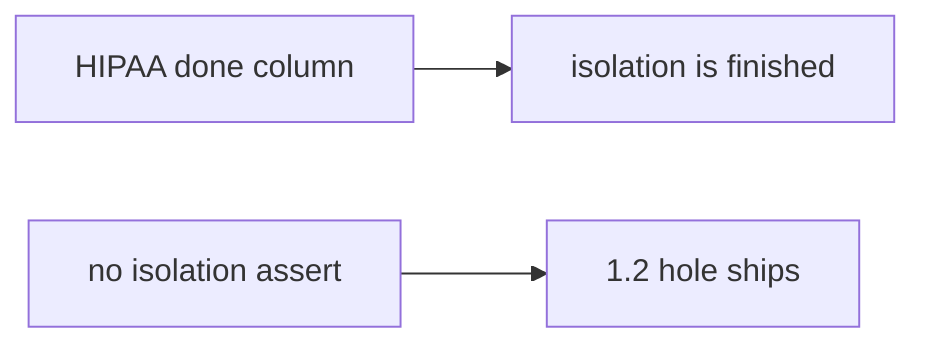

# Same idea on a clinic HIPAA done column

**Kind:** transfer-challenge
**Loop step:** 7 Transfer

## Use it somewhere new

You get a **clinic HIPAA “done” column**. A fake isolation row sits in a checklist.

`covered("AUTHZ-1", [status-only])` must be false. For a clinic, status-only is not coverage; an isolation assert may count. A pasted checklist is still inventory, not a tailored matrix.

An EHR-lite “we imported the HIPAA checklist and marked isolation done,” plus a green CI.

## Picture: same check, clinical checklist

A clinic requirement still has to be an isolation row, not a checklist tick. Marking HIPAA isolation done does not assert isolation.

| Notes app | Clinic sketch |
|---|---|
| AUTHZ-1 is the isolation row | Fake HIPAA isolation row |
| Status-only must not count | Done column must not count |
| `covered("AUTHZ-1", status_only)` | `covered("AUTHZ-1", status_only)` on local practice files |
| Optimistic project manager | Same actor — **not** a live clinic |
| Isolation assert in the dict | Isolation assert in the dict |

If the HIPAA column is Done while `covered` only matches `req`, the rule is gone. A checklist PDF import, pytest-cov, and a later draft of a practice guide do not assert isolation. The mobile storage row from 8.2 is the same check family — name it, do not scrape a live mobile portal here. A 200-only test that sets the isolation flag by mistake is 9.3.

Status-only still is not coverage. An isolation-assert may still count. Marking HIPAA isolation done without an isolation assert leaves `covered("AUTHZ-1", status_only)` true. The local check is `test_status_only_row_is_not_coverage` — on a practice, not a live governance product.

## Write this for a clinic HIPAA done column

1. who might try (optimistic status column — not a live hospital);
2. what you trust (the coverage check is the promise; checklist membership is not);
3. what must not happen (`covered("AUTHZ-1", status_only)` true);
4. a check on **local** practice files only (no live governance scrape);
5. leftover (unnamed extra advanced rows, exceptions without expiry);
6. whether a human exception path exists (must state what is uncovered and when it expires).

Use fake labels. Do not use real patient names. Also name the mobile storage row from 8.2.

## What is not good enough

| Reject | Why |
|---|---|
| “The checklist is imported” | Inventory, not coverage |
| Live clinic / real patient data | Course rules |
| A later draft of a practice guide as certified | Still a draft; not the verification gate |
| Green CI as AUTHZ-1 | Wrong observation |
| An old mobile-level sticker as current | Obsolete labels |

## Practice

Attach an isolation test to the HIPAA done column. Keep the answer keys closed. `labs/9.1/9.1-lab` is the only running system you may break. Do not scrape a public checklist.

## What this page is not doing

Do not try live-target governance products. Do not use real patient charts. This page does not finish the verification gate.
