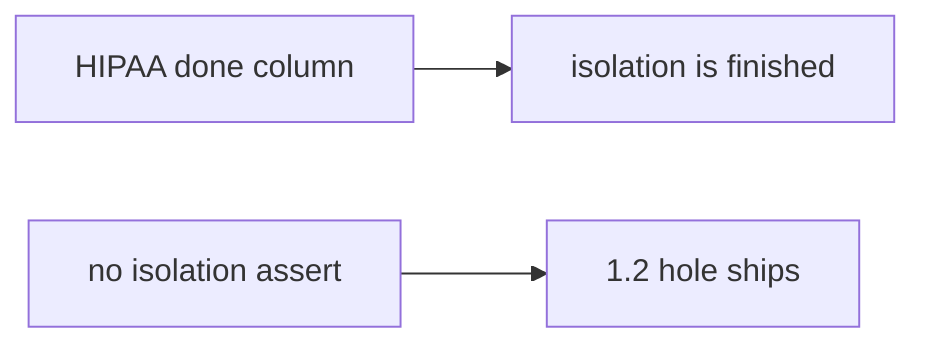

# 9.1-LO-07 — Transfer: clinic HIPAA done column

**Kind:** transfer-challenge
**Loop step:** 7 Transfer
**Standards:** OWASP ASVS 5.0.0 (final) Level 2 backbone; MASVS 2.1.0 STORAGE for the mobile analogue. SSDF 1.2 IPD remains **draft**.

## Change the workplace; keep status from meaning coverage

Do not answer with a Top 10 / CWE / scanner as the definition of security.

**Prompt:** Clinic HIPAA “done” column. Also name MASVS-STORAGE for 8.2.

**Product sketch:** EHR-lite “we imported the HIPAA checklist and marked isolation done,” plus a green CI.

Rewrite the SecureCollab sentence. Include:

1. attacker capabilities (optimistic status column — not a live hospital);
2. trust assumptions (coverage predicate is TCB; checklist membership is not);
3. forbidden outcome (`covered("AUTHZ-1", status_only)` true, not “HIPAA”);
4. a test idea on a **local** fixture only;
5. residual (unnamed Level 3 `v5.0.0-8.3.2`, exceptions without expiry);
6. WCAG if a human exception path exists (state what is uncovered and when it expires).

## Mental model: same predicate, clinical checklist

## What graders reject

| Reject | Why |
|---|---|
| “ASVS imported” | Inventory, not coverage |
| Live clinic / real PHI | Lab policy |
| “SSDF 1.2 certified” | 1.2 is IPD draft; not Gate 9 |

## Practice

One page. No keys. `labs/9.1/9.1-lab` is the only running system you may break.
