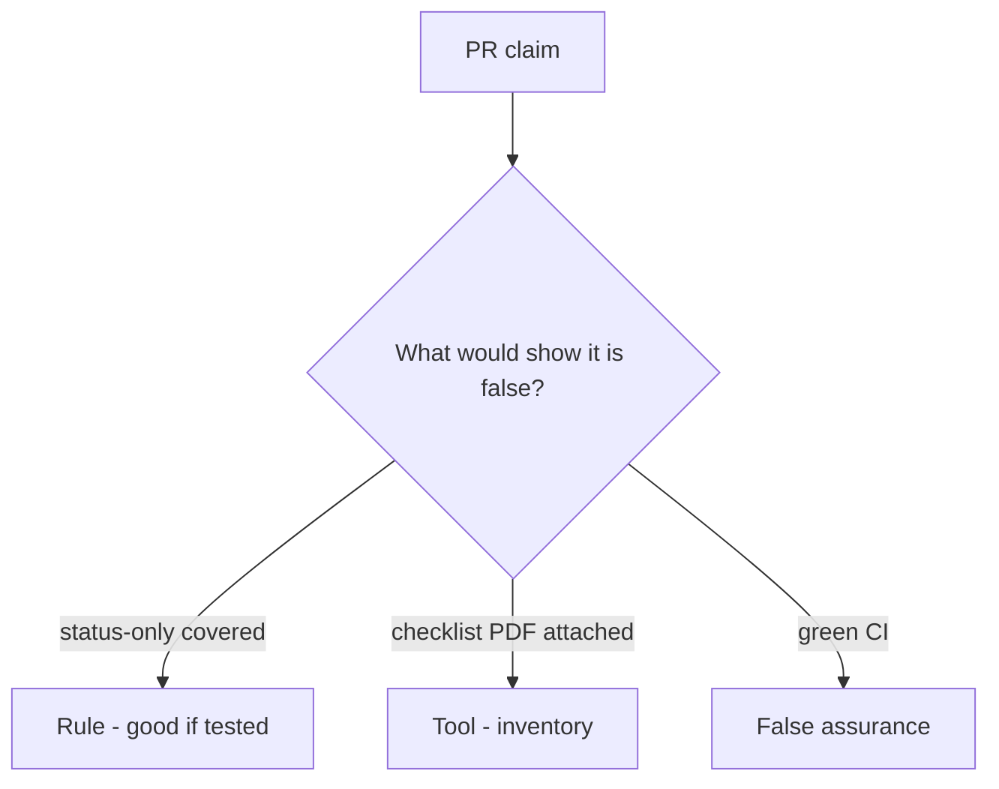

# Would you merge this any-req-match covered?

**Kind:** code-review
**Loop step:** Review

## What you are reviewing

Open `labs/9.1/9.1-lab/vulnerable/` as a coverage-check PR. Does a status-only AUTHZ-1 row still count as covered?

Begin at `covered` and the AUTHZ-1 row, not with a PDF. Do not treat “will map tests later” as a green `test_status_only_row_is_not_coverage`.

## Picture: matching any requirement id counts as covered

**any matching requirement id counts as covered**.

Status-only still is not coverage. If the change never checks `req` **and** `asserts_isolation`, that false-assurance path is still open. A checklist PDF without that check is still the same problem.

HTTP-200 tests that lie about isolation are 9.3. Exceptions without expiry are E6. Do not claim the verification gate.

## Problems to find (name them yourself)

- status-only coverage
- Checklist copied wholesale
- No isolation assert
- Exceptions without expiry

Also reject: live portals; closing findings without re-running `test_status_only_row_is_not_coverage`; keys in learner notes; claiming the verification gate; obsolete mobile-level stickers as the current bar.

## Common mix-ups

- Checklist certification exists as a sticker
- Number of tests is coverage
- Green build is the verification gate
- A later draft of a practice guide is final
- Old mobile-level stickers are current levels

## Use it somewhere new

Marking HIPAA isolation done without an isolation assert is not the proof. What still has to be asserted so a status-only row is not coverage?

## Can people still use it

A human exception path must say what is still uncovered and when it expires. Do not hide the gap behind “see PDF.”

## What this page is not doing

A status-only coverage row plus “will map tests later” still needs someone who owns the map. Do not scrape a live portal to prove the finding.
