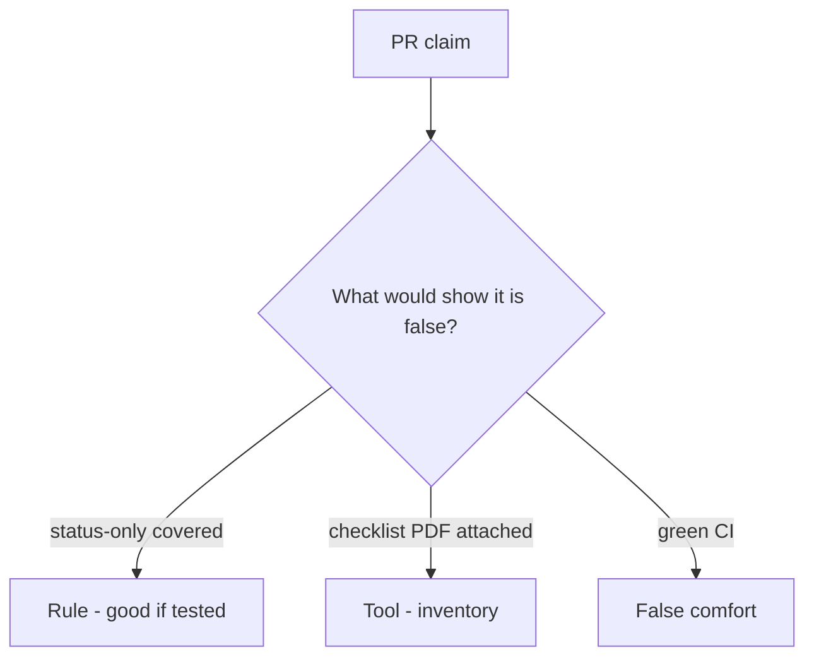

# Review any-req-match covered like a pull request

**Kind:** code-review
**Loop step:** Review

Intended findings live only in the answer-key folder — not here. Do not open that file until your review has been evaluated.

## What you are reviewing

A colleague ships the notes app’s coverage check. Review `labs/9.1/9.1-lab/vulnerable/` as that change. Your job is not to count suspicious lines. Reconstruct whether a status-only AUTHZ-1 row still counts as covered, compare that with the rule, and write changes a developer can verify.

Start at `covered` and the AUTHZ-1 row, not at a scanner color or a PDF screenshot. The check you already ran (`test_status_only_row_is_not_coverage`) is the rule test. A comment “will map tests later” is not.

## Picture: matching any requirement id counts as covered

Start with this seeded smell: **any matching requirement id counts as covered**. Label it rule, tool, or false comfort before you accept the change.

Classification starts at the protected effect (status-only not covered). Everything that is not `req` **and** `asserts_isolation` at that call is a candidate false-comfort path. A checklist PDF without that pytest is the same smell, not a different finding class.

HTTP-200 tests that lie about isolation are 9.3. Exceptions without expiry are E6. Do not skip `test_status_only_row_is_not_coverage`. Do not claim the verification gate.

## Seeded smells (label them yourself)

- status-only coverage
- Checklist copied wholesale
- No isolation assert
- Exceptions without expiry

Also reject: live portals; closing findings without re-running `test_status_only_row_is_not_coverage`; keys in learner notes; claiming the verification gate; obsolete mobile-level stickers as the current bar.

## Common mix-ups

- Checklist certification exists as a sticker
- Number of tests is coverage
- Green build is the verification gate
- A later draft of a practice guide is final
- Old mobile-level stickers are current levels

## Practice

Write three review notes a maintainer could act on. Each note: what you saw, rule or false comfort, suggested structural change, leftover you will **not** delete. Tie at least one note to `test_status_only_row_is_not_coverage`. Do not open the keys file.

## Use it somewhere new

Clinic change that “marked HIPAA isolation done” without an isolation assert is an incomplete review of the proof. Name the independent falsehood that would still keep status-only uncovered.

## Can people still use it

A human exception path must say what is still uncovered and when it expires. Do not hide the gap behind “see PDF.”

## What this page is not doing

Do not merge by adding a comment “will map tests later.” That comment is leftover without an owner. Do not scrape a live portal to prove the finding.
