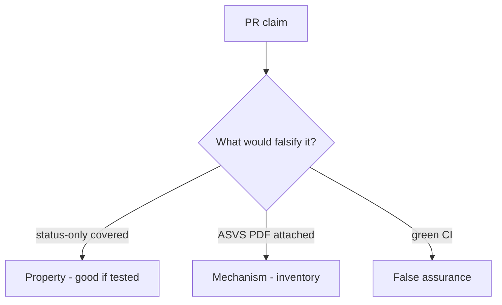

# 9.1-LO-08 — Review any-req-match covered as a PR

**Kind:** code-review
**Loop step:** Review
**Standards:** OWASP ASVS 5.0.0 (final) `v5.0.0-8.2.1`. NIST SSDF 1.1 PW.8.

## Review the fixture as if it were SecureCollab Gate 9 evidence

Review `labs/9.1/9.1-lab/vulnerable/` as a SecureCollab PR. Intended findings live only in `content/assessment/keys/9.1.md` — not here.

## Mental model: property, mechanism, or false assurance

Seeded smells (label them yourself; do not open the keys file):

- status-only coverage
- ASVS copied wholesale
- No isolation assert
- Exceptions without expiry

Also reject: live portals, keys in lessons, claiming Gate 9, MASVS L1/L2/R as current.

## Misconceptions

- ASVS certification exists as a sticker
- Number of tests is coverage
- Green build is Gate 9

## Practice

Write three review notes. Tie at least one to `test_status_only_row_is_not_coverage`.

## Transfer

Clinic PR that “marked HIPAA isolation done” without an isolation assert is incomplete.
