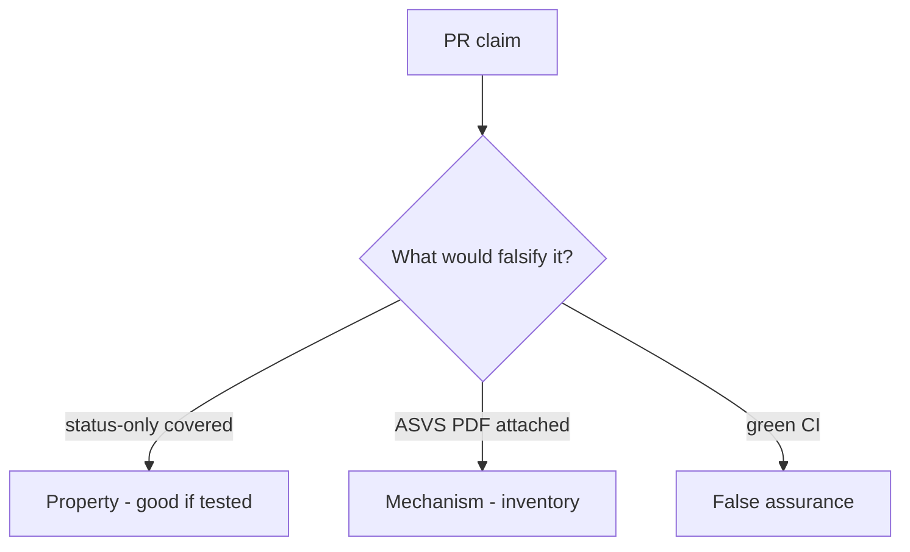

# 9.1-LO-08 — Review any-req-match covered as a PR

**Kind:** code-review
**Loop step:** Review
**Standards:** OWASP ASVS 5.0.0 (final) `v5.0.0-8.2.1`. NIST SSDF 1.1 (final) PW.8. Do not use MASVS L1/L2/R.

## Review the fixture as if it were SecureCollab Gate 9 evidence

Review `labs/9.1/9.1-lab/vulnerable/` as a SecureCollab PR. Your job is not to count suspicious lines. Reconstruct whether a status-only AUTHZ-1 row still counts as covered, compare that with the module invariant, and write changes a developer can verify.

Intended findings live only in `content/assessment/keys/9.1.md` — not here. Do not open the keys file until your review has been evaluated.

## Mental model: status-only coverage

Start with this seeded smell: **status-only coverage**. Label it property, mechanism, or false assurance before you accept the PR.

Classification starts at the protected effect (status-only not covered). Everything that is not `req` **and** `asserts_isolation` at that call is a candidate false-assurance path. An ASVS PDF without that pytest is the same smell, not a different finding class.

HTTP-200 tests that lie about isolation are 9.3. Exceptions without expiry are E6. Do not skip `test_status_only_row_is_not_coverage`. Do not claim Gate 9.

## Seeded smells (label them yourself)

- status-only coverage
- ASVS copied wholesale
- No isolation assert
- Exceptions without expiry

Also reject: live portals; closing findings without re-running `test_status_only_row_is_not_coverage`; keys in lessons; claiming Gate 9; MASVS L1/L2/R as current.

## Misconceptions this module refuses

- ASVS certification exists as a sticker
- Number of tests is coverage
- Green build is Gate 9
- SSDF 1.2 IPD is final
- MASVS L1/L2/R are current levels

## Practice

Write three review notes a maintainer could act on. Each note: observation, property or false assurance, suggested structural change, residual you will **not** delete. Tie at least one to `test_status_only_row_is_not_coverage`.

## Transfer

Clinic PR that “marked HIPAA isolation done” without an isolation assert is an incomplete assurance review. Name the independent falsehood that would still keep status-only uncovered.

## Non-goals

Do not merge by adding a comment “will map tests later.” That comment is a residual without an owner. Do not scrape a live portal to prove the finding.
