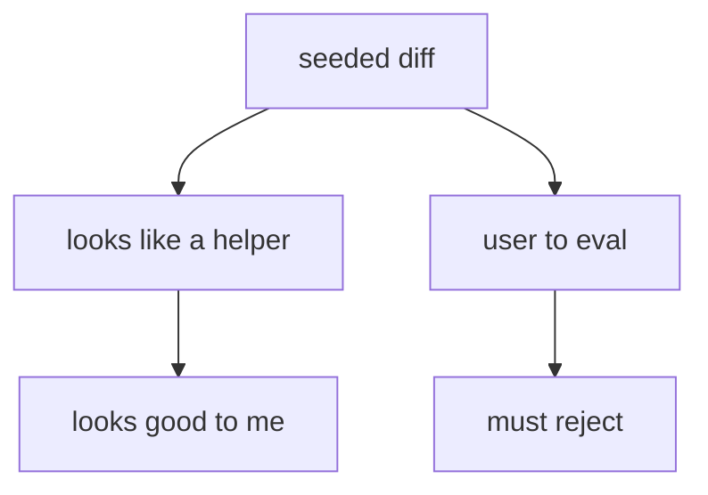
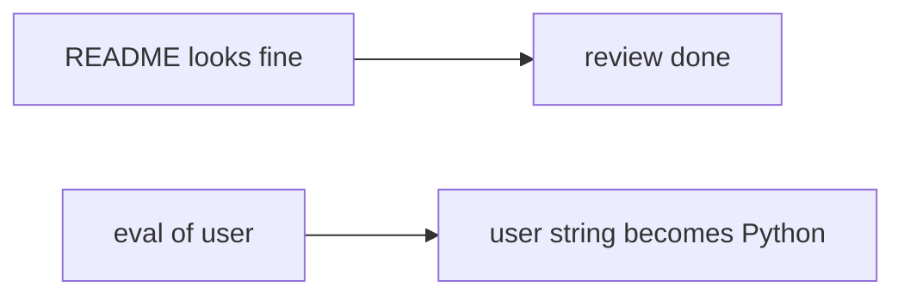

# eval on user input must not be approved

**Kind:** concept-model
**Loop step:** 1 Property

## The rule

The notes app this week reviews a helper that exports a note. Review is a gate. `eval` on what a user typed must not get a yes.

Last topic (6.1) taught that a name is data, not a shell program. This week is the same idea at merge time: a user string is data, not Python grammar. “Looks good to me” after “the screen still looks fine” is not a finished review.

> `review_ok("x = eval(user)")` must be false.

What must not happen is **eval on user input approved in review**. That is an integrity failure of the change-control gate — the interpreter boundary from 6.1, checked before the helper ships.

You need to avoid `eval` and similar dynamic execution (template languages that run expressions, and kin). Writing down that eval is dangerous is later, stricter paperwork. It is not the same as rejecting the change. A review guide tells you *how to look* — data flow, who is allowed, state, configuration — not a sticker to paste on. “A person looks at the code” is vocabulary for this week, not a course gate. A later draft of that vocabulary stays a draft.

The practice uses `'eval(' not in diff`. That substring check is a **stand-in**, not a complete review check. `exec(`, other dynamic-execution languages, and generated code (later elective) can still slip past it.

## Picture: looks fine vs following the data



## Picture: approved without asking the interpreter



**The tool (not the rule):** formatter continuous integration, a scanner “looks good,” a chat bot saying “looks safe,” or the lab substring itself.

## Why it happens, what it costs, how you stop it, how you notice, how you recover

| Slice | For this rule |
|---|---|
| Why it happens | The reviewer trusts that it looks like a helper |
| What has to be true first | `review_ok` is true for `eval(user)` |
| Trigger | The helper is merged |
| What it costs | User input becomes Python grammar (6.1) |
| How you stop it | Review data flow, who is allowed, and interpreters; reject eval |
| How you notice | `review_block_eval` |
| How you recover | Revert; add tests (next topic, 9.3); do not treat the substring check as done |

## What the framework does vs what you still have to check

GitHub’s “approve” button is not this rule. Formatters do not see eval as a grant of Python. Later review bots (9.4) are a help, not the whole check.

What this practice is supposed to show: **this** review helper, `review_ok("x = eval(user)")` is false — files in `labs/9.2/9.2-lab`. Fake diffs only. Local only.

## What the tool cannot do

- The substring misses `exec(`, `__import__`, other expression languages, and template filters that mark text as trusted.
- Generated code can put eval back after review (later elective).
- Writing down that eval is dangerous without rejecting it.

## Can people still use it

A blocked review must say *why* in plain language (eval on user input), not only a policy code. Color or a code alone is not enough.

## Practice

Name the interpreter. Then run:

```text
python3 -m pytest labs/9.2/9.2-lab/tests --impl vulnerable
python3 -m pytest labs/9.2/9.2-lab/tests --impl fixed
```

## Use it somewhere new

Terraform `local-exec`; GitHub Actions `run:` with untrusted input; clinic eval in a report template.

## What this page is not doing

Do not use weaponized eval payloads. Do not use live GitHub orgs. This site does not mark you as finished. Answer keys are not on this site.
