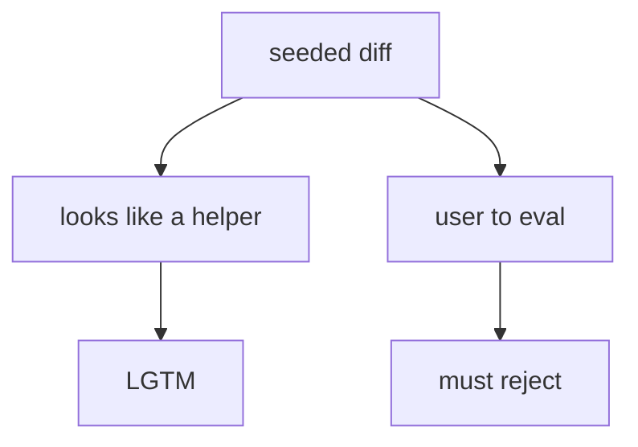
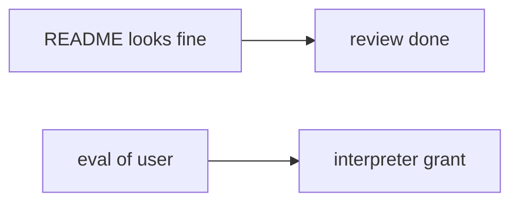

# 9.2-LO-01 — eval on user input must not be approved

**Kind:** concept-model
**Loop step:** 1 Property
**Standards:** OWASP ASVS 5.0.0 (final) `v5.0.0-1.3.2`; `v5.0.0-15.1.5` is **Level 3, advanced**. OWASP Code Review Guide v2 (2017) as **guidance**. NIST SSDF 1.1 (final) PW.7. SSDF 1.2 IPD is **draft**.

## The claim this module owns

SecureCollab review of a note-export helper must not approve `eval` on user input. That is 6.1’s interpreter confusion at review time: the name is data, not Python grammar. LGTM after “the UI still looks fine” is not complete mediation.

> `review_ok("x = eval(user)")` must be false.

The forbidden outcome is **eval on user input approved in review**. That is integrity of the change-control gate — a 1.1 cell for the interpreter boundary.

ASVS `v5.0.0-1.3.2` wants applications to avoid `eval()` and similar dynamic execution (SpEL, and kin). `v5.0.0-15.1.5` (document dangerous functionality) is **Level 3, advanced** — documenting eval is not the same as rejecting it. The Code Review Guide is *how to look* (data flow, authority, state, configuration), not a sticker. SSDF 1.1 PW.7 is vocabulary for “a person looks at the code.”

The lab uses `'eval(' not in diff`. That substring denylist is a **stand-in**, not a complete review oracle. `exec(`, SpEL, and generated code (E1) remain.

## Mental model: visual plausibility vs data flow



## Mental model: LGTM without interpreters



**Mechanism (not the property):** formatter CI, scanner LGTM, ChatGPT “looks safe,” the lab substring itself.

## Root cause vs impact vs prevention vs detection vs recovery

| Slice | For this property |
|---|---|
| Root cause | Reviewer trusts visual plausibility |
| Preconditions | `review_ok` true for `eval(user)` |
| Trigger | Merge of the helper |
| Impact | User input becomes Python grammar (6.1) |
| Prevention | Review data flow / authority / interpreters; reject eval |
| Detection | `review_block_eval` |
| Recovery | Revert; add 9.3 tests; do not treat the denylist as done |

## Framework defaults versus the review guarantee

GitHub “approve” is not 1.3.2. Black/ruff do not see eval as a grant. 9.4 bots are an aid, not an oracle.

## Mechanism limits

- Substring misses `exec(`, `__import__`, SpEL, Jinja `|safe`.
- Generated code (E1) can reintroduce eval after review.
- Documenting dangerous functionality (`v5.0.0-15.1.5`, Level 3) without rejecting it.

## Usability and accessibility

A blocked review must say *why* in plain language (eval on user input), not only “policy P12” (WCAG 2.2 4.1.3).

## Practice

Name the interpreter. Then run:

```
python3 -m pytest labs/9.2/9.2-lab/tests --impl vulnerable
python3 -m pytest labs/9.2/9.2-lab/tests --impl fixed
```

The first command must fail. The second must pass.

## Transfer

Terraform `local-exec`; GitHub Actions `run:` with untrusted input; clinic eval in a report template.

## Non-goals

Weaponized eval payloads, live GitHub orgs, claiming Gate 9. Gates 0–10 and M0–M5 stay **not-attempted**. Answer keys are not in this file.
