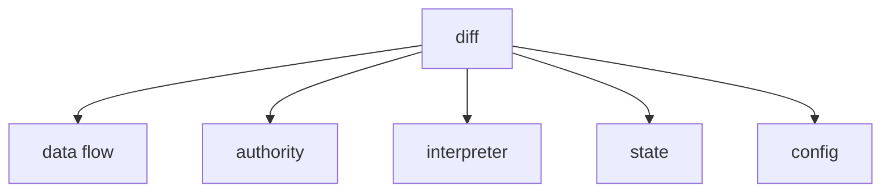
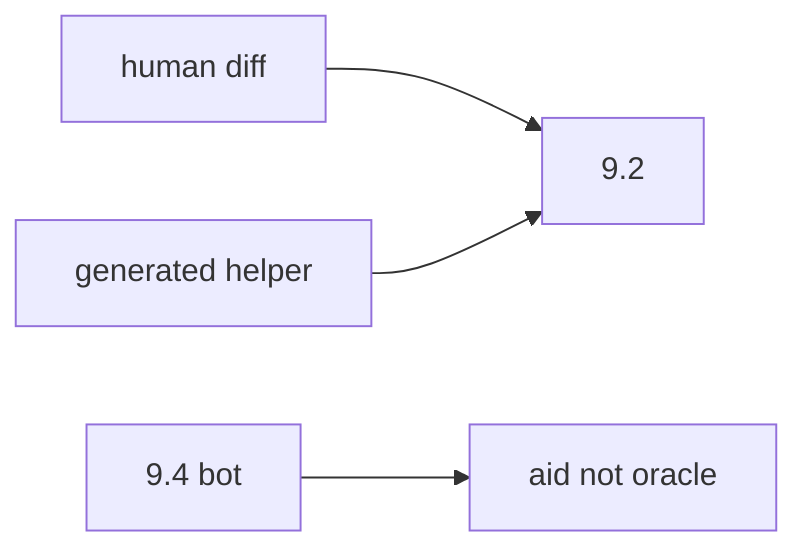

# 9.2-LO-02 — Visual plausibility vs data-flow review

**Kind:** design-exercise
**Loop step:** 2 Model
**Standards:** OWASP Code Review Guide v2 (2017) as guidance. ASVS `v5.0.0-1.3.2`. NIST SSDF 1.1 PW.7.

## Can a second engineer name pytest cases from your review questions?

“I LGTM’d the screenshot” is not this lesson. A reviewable model names **data flow, authority, interpreter, state, and configuration**.

SecureCollab freeze: local `review_ok(diff)`. No live GitHub.

## Mental model: five questions

## Mental model: generated code is still in scope

## Step 1: freeze pieces

| Piece | This system |
|---|---|
| Subjects | optimistic reviewer; generated-code bot |
| Objects | export helper; user string |
| Actions | `review_ok` |
| Channels | PR diff |
| TCB | review of interpreters and authority |
| Untrusted | visual plausibility; formatters; 9.4 bots |
| State / time | merge; later generated rewrite (E1) |
| 1.1 cell | integrity of the interpreter boundary |

## Step 2: write cells

| Subject | Object | Action | Decision |
|---|---|---|---|
| eval(user) | merge | approve | deny |
| int(user) helper | merge | approve | may allow |
| README-only | merge | treat as reviewed | deny |
| 9.4 bot LGTM | merge | treat as oracle | deny |

## Practice

Draw the questions. Point at `labs/9.2/9.2-lab` file `review.py`.

## Transfer

GitHub Actions yaml: untrusted `github.event` into `run:`.

## Residual risk

Substring stand-in; `exec(`; SpEL; E1 generated code.

## Non-goals

Top 10 as the definition of security. Keys stay out of lessons.
