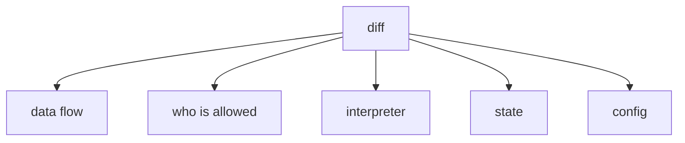
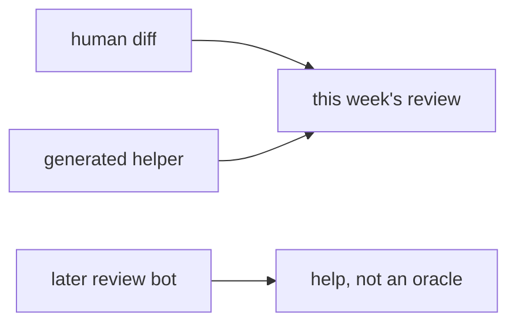

# Looks fine vs following the data

**Kind:** design-exercise
**Loop step:** 2 Model

## Could someone else name the checks?

“I approved the screenshot” is not this lesson. A map someone else can test names **data flow**, **who is allowed**, **the interpreter**, **state**, and **configuration**.

The notes app this week: local `review_ok(diff)`. No live GitHub.

> `eval` on a user string must not be approved. An honest helper that uses `int(user)` may pass.

## Picture: five questions

## Picture: generated code is still in scope

A bot that later greps the tree (9.4) is a help. It does not replace the five questions.

## Step 1: name the pieces

| Piece | This system |
|---|---|
| Who | optimistic reviewer; generated-code bot |
| What | export helper; user string |
| Actions | `review_ok` |
| Paths | pull-request diff |
| What you trust | review of interpreters and who is allowed |
| What you do not trust | that it looks fine; formatters; later review bots |
| Time | merge; later generated rewrite |
| The rule | Integrity of the interpreter boundary |

## Step 2: write allow and deny

| Who | What | Action | Decision |
|---|---|---|---|
| eval(user) | merge | approve | deny |
| int(user) helper | merge | approve | may allow |
| README only | merge | treat as reviewed | deny |
| later bot “looks good” | merge | treat as oracle | deny |

A missing “eval(user) × merge × deny” row is how “the screen still looks fine” becomes a yes. Write the hole.

## Practice

Draw the five questions. Point at `labs/9.2/9.2-lab` file `review.py`. Fake diffs only.

## Use it somewhere new

GitHub Actions yaml: untrusted event data into `run:`.

## What can still go wrong

Substring stand-in; `exec(`; other expression languages; generated code after review.

## What this page is not doing

Do not define security as a famous-bugs list. Do not run this map against a live GitHub org. Answer keys stay out of lessons.
