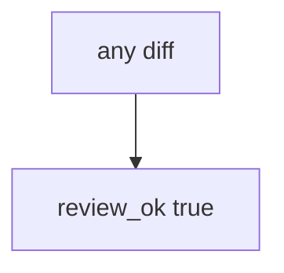

# Practice: always-true review_ok

**Kind:** mechanism-lab
**Loop step:** 3 Break

## Try it

The practice is not a website you attack. It is a tiny Python `review_ok(diff)`. It does not merge anything. The failure is already in the function: it returns true for every string. That is a **failed rule**, not a trophy eval.

The rule under test:

> Eval on user input must not be approved. `review_ok("x = eval(user)")` must be false.

## Where you may practice

Only `labs/9.2/9.2-lab` is in scope. The helper is in-process: `review_ok(diff)`. Fake diff string `x = eval(user)` — the lab’s stand-in identifier, not a working exploit.

Do not write a working exploit. Do not run eval on untrusted input outside this practice. Do not probe a live GitHub org. Do not paste eval payloads “to see what happens.”

What must not happen: eval on user input approved in review. `review_ok("x = eval(user)")` returns true.

Who could do this: a helper that looks visually fine. That stands in for a clinic “designers can put expressions in the discharge template,” Terraform `local-exec`, or a GitHub Actions `run:` that interpolates untrusted input. What is supposed to stop this: `review_ok` asks the **interpreter question** (6.1 at review time). Formatter continuous integration, a scanner “looks good,” and “the screen still looks fine” are not enough.

## Picture: every diff is approved



The broken files show **cause** (no interpreter question), not an eval trophy. What has to be true first: `review_ok` returns true for every string. You do not need GitHub. You must not run eval on live input.

You need to avoid `eval` and similar dynamic execution. Module 6.1 already said the name is data, not Python grammar. This check is **the merge gate that should have caught it**.

## What to look at — cause, not a dump

Read `vulnerable/review.py`. It returns true for every string. Tests:

- `test_eval_on_user_input_is_rejected`
- `test_honest_diff_without_eval_may_pass` — `int(user)` may pass on both

You do not need a new payload. The failure of `test_eval_on_user_input_is_rejected` *is* the evidence.

| What you see | What kind of failure | Not the lesson |
|---|---|---|
| `review_ok` true for every string | Always-approve; no interpreter question | A scanner name |
| `x = eval(user)` still approved | User string treated as Python | A live eval trophy |
| Honest `int(user)` also true | Looks-fine path still open | “the formatter will catch it” |

## Why it happens, what it costs, how you stop it, how you notice, how you recover

| Slice | This practice |
|---|---|
| The rule | `review_ok("x = eval(user)")` is false |
| Why it happens | The reviewer trusts that it looks fine / always-approve |
| What has to be true first | `review_ok` true for every diff |
| Trigger | The helper is merged |
| What it costs | User input becomes Python grammar (6.1) |
| How you stop it | Review data flow, who is allowed, and interpreters; reject eval |
| How you notice | `review_block_eval`; never the payload |
| How you recover | Keep reject; revert; add tests (9.3) |
| Not the lesson | A scanner name; weaponized eval; live GitHub |

## What the framework does vs what you still have to check

GitHub’s “approve” button is not this rule. Formatters do not see eval as a grant of Python. Later review bots are a help, not an oracle. What this practice is supposed to show: eval-on-user is not approved.

## Practice

From the repository root, in a throwaway environment:

```text
python3 -m pytest labs/9.2/9.2-lab/tests --impl vulnerable
```

Run from `labs/9.2/9.2-lab` if a repo-root collection picks up `site/`. Record `test_eval_on_user_input_is_rejected`. Do not probe public hosts. A setup error is not proof the rule holds.

## Use it somewhere new

Clinic report template with eval: predict without leaving this directory. Do not run eval on live input.

## What this page is not doing

No weaponized eval, live GitHub, or copy-paste exploits. The lab substring is a stand-in, not a cookbook. Do not “fix” the practice by deleting the test.
