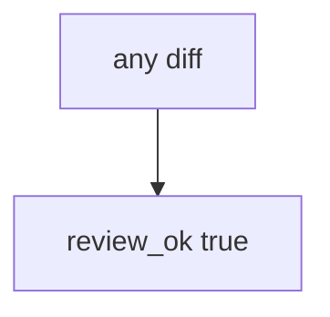

# 9.2-LO-03 — Observe always-true review_ok, do not weaponize eval

**Kind:** mechanism-lab
**Loop step:** 3 Break
**Standards:** OWASP ASVS 5.0.0 (final) `v5.0.0-1.3.2`.

## Authorized scope

`labs/9.2/9.2-lab` only. Synthetic diff string `x = eval(user)`. Do not write a working exploit or run eval on untrusted input outside this fixture.

**Forbidden outcome:** eval on user input approved in review.

## Mental model: every diff is approved



The vulnerable tree demonstrates **cause** (no interpreter question). Do not paste eval payloads into notes.

## What to read in the fixture

`vulnerable/review.py` returns true for every string. Tests require `review_ok('x = eval(user)')` to be false.

## Root cause vs impact

| Slice | Lab |
|---|---|
| Root cause | Visual plausibility / always-approve |
| Impact | Interpreter grant merges |
| Not the lesson | A scanner name as the definition |

## Practice

```
python3 -m pytest labs/9.2/9.2-lab/tests --impl vulnerable
```

Record `test_eval_on_user_input_is_rejected`. Do not probe public hosts.

## Transfer

Clinic report template with eval: predict without leaving this directory.

## Non-goals

No weaponized eval, live GitHub, or copy-paste exploits.
