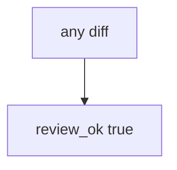

# 9.2-LO-03 — Observe always-true review_ok, do not weaponize eval

**Kind:** mechanism-lab
**Loop step:** 3 Break
**Standards:** OWASP ASVS 5.0.0 (final) `v5.0.0-1.3.2`. `v5.0.0-15.1.5` documenting dangerous functionality is **Level 3, advanced**. OWASP Code Review Guide v2 (2017) is **guidance**. NIST SSDF 1.1 (final) PW.7. SSDF 1.2 IPD is **draft**.

## Authorized scope

`labs/9.2/9.2-lab` only. The fixture is an in-process `review_ok(diff)`. Synthetic diff string `x = eval(user)` — the lab’s stand-in identifier, not a working exploit. Do not write a working exploit or run eval on untrusted input outside this fixture. No live GitHub orgs.

**Forbidden outcome:** eval on user input approved in review. `review_ok("x = eval(user)")` returns true.

Attacker capability in this lab: a helper that looks visually fine. That stands in for a clinic “designers can put expressions in the discharge template,” Terraform `local-exec`, or a GitHub Actions `run:` interpolating untrusted input. Trust assumption: `review_ok` is supposed to ask the **interpreter question** (6.1 at review time). Formatter CI, scanner LGTM, and “the UI still looks fine” are not in the TCB for this cell.

## Mental model: every diff is approved



The vulnerable tree demonstrates **cause** (no interpreter question). Do not paste eval payloads into notes. Preconditions: `review_ok` returns true for every string. You do not need GitHub. You must not run eval on live input.

ASVS `v5.0.0-1.3.2` wants applications to avoid `eval()` and similar dynamic execution. Module 6.1 already said the name is data, not Python grammar; this cell is **the merge gate that should have caught it**.

## What to read in the fixture

`vulnerable/review.py` returns true for every string. Tests:

- `test_eval_on_user_input_is_rejected`
- `test_honest_diff_without_eval_may_pass` — `int(user)` may pass on both

You do not need a new payload. The failure of `test_eval_on_user_input_is_rejected` *is* the evidence.

Do not open the fixed tree yet. Diagnose the cause first.

## Root cause vs impact vs prevention vs detection vs recovery

| Slice | This lab |
|---|---|
| Required property | `review_ok("x = eval(user)")` is false |
| Root cause | Reviewer trusts visual plausibility / always-approve |
| Preconditions | `review_ok` true for every diff |
| Trigger | Merge of the helper |
| Impact | User input becomes Python grammar (6.1) |
| Prevention | Review data flow / authority / interpreters; reject eval |
| Detection | `review_block_eval`; never the payload |
| Recovery | Keep reject; revert; add 9.3 tests |
| Not the lesson | A scanner name; weaponized eval; live GitHub |

## Framework defaults versus the review guarantee

GitHub “approve” is not 1.3.2. Black/ruff do not see eval as a grant. 9.4 bots are an aid, not an oracle. The application guarantee is: **this** fixture, eval-on-user is not approved.

## Practice

```text
python3 -m pytest labs/9.2/9.2-lab/tests --impl vulnerable
```

Run from `labs/9.2/9.2-lab` if a repo-root collection picks up `site/`. Record `test_eval_on_user_input_is_rejected`. Do not probe public hosts. An environment error is not security evidence.

## Transfer

Clinic report template with eval: predict without leaving this directory. Do not run eval on live input.

## Non-goals

No weaponized eval, live GitHub, or copy-paste exploits. The lab substring is a stand-in, not a cookbook.
