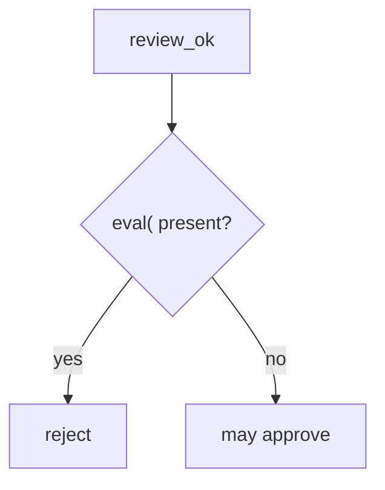

# 9.2-LO-04 — Reject eval in the review predicate

**Kind:** design-exercise
**Loop step:** 4 Build
**Standards:** OWASP ASVS 5.0.0 (final) `v5.0.0-1.3.2`. NIST SSDF 1.1 PW.7.

## Structural means the review asks the interpreter question

`review_ok` must be false when the diff contains `eval(`. That is the **lab stand-in** for “user input is not Python grammar.” Name the residual: `exec(`, SpEL, and generated code are not this check.

## Mental model: fail closed on eval



Fail-safe: unknown dynamic execution denies in a real review even if this fixture’s substring misses it. Do not treat the denylist as 1.3.2 complete.

## Why this restores the cell

| After the fix | Must be true |
|---|---|
| `x = eval(user)` | `review_ok` false |
| `x = int(user)` | `review_ok` true |

## What this is not

A complete review oracle. A formatter. A 9.4 bot. Documenting eval as dangerous (`v5.0.0-15.1.5`, Level 3) without rejecting it.

## Practice

Name the residual. Run:

```
python3 -m pytest labs/9.2/9.2-lab/tests --impl fixed
```

Must pass.

## Transfer

Terraform: reject `local-exec` interpolating untrusted names the same way 6.1 rejects a shell string.

## Residual risk

Substring stand-in; generated reintroduction (E1); tests still required (9.3).
