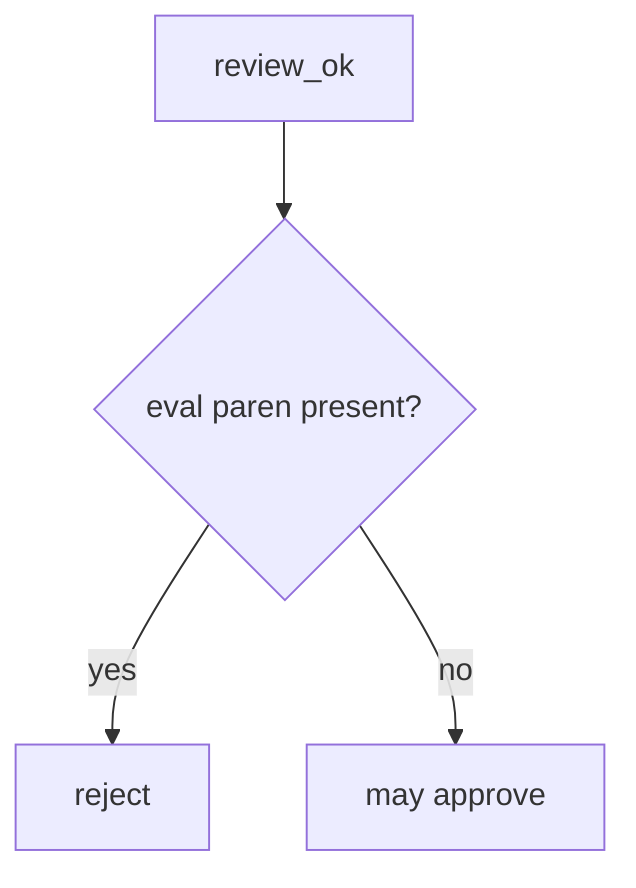

# Reject eval in the review check

**Kind:** design-exercise
**Loop step:** 4 Build

## The rule

A formatter is not the fix. A later review bot is not the fix. Writing down that eval is dangerous without rejecting it is not the fix.

Structural means the review asks the interpreter question. `review_ok` must be false when the diff contains `eval(`. That is the **lab stand-in** for “user input is not Python grammar.”

The smallest restore for notes-app merge gating is: `x = eval(user)` → not approved. Fail closed: unknown dynamic execution denies in a real review even if this practice’s substring misses it. Do not treat the denylist as the whole avoid-eval rule. Do not fail open because continuous integration formatted the file.

## Picture: fail closed on eval



The lab’s repaired files use `'eval(' not in diff`. Name the leftover: `exec(`, other expression languages, template filters that mark text as trusted, and generated code are not this check. Writing down that eval is dangerous without rejecting it is a different false comfort. Tests are still required after a human reject (next topic, 9.3).

Industry lists ask for you to avoid eval. This pytest is that sentence for the lab string.

## What the repaired files must show

Read `fixed/review.py` against this checklist. Do not treat the snippet as a production review product.

| After the fix | Must be true |
|---|---|
| `x = eval(user)` | `review_ok` false |
| `x = int(user)` | `review_ok` true |

Fail closed: if you cannot tell whether the diff grants an interpreter, the answer is reject. Uncertainty is a **deny**, not a yes because the helper looked well-formed.

## What this is not

A complete review oracle. A formatter. A later review bot. Writing down that eval is dangerous without rejecting it. A chat bot saying “looks safe.” A draft vocabulary sticker.

## What the tool cannot do

- Substring misses `exec(`, `__import__`, other expression languages, and template filters that mark text as trusted.
- Generated code can put eval back after review.
- Writing down that eval is dangerous without rejecting it.
- Tests still required (9.3).

## Practice

Name the leftover (substring is a stand-in). Run:

```text
python3 -m pytest labs/9.2/9.2-lab/tests --impl fixed
```

It must pass. Run from the lab directory if collection at repo root is polluted. Then write one sentence: which rule is restored, and which leftover you refused to delete.

## Use it somewhere new

Terraform: reject `local-exec` interpolating untrusted names the same way 6.1 rejects a shell string.

## What can still go wrong

Substring stand-in; generated reintroduction; `exec(` / other expression languages; tests still required (9.3).

## What this page is not doing

Do not weaponize eval. Do not claim a course gate from a formatter screenshot. Do not present a draft vocabulary as final.
