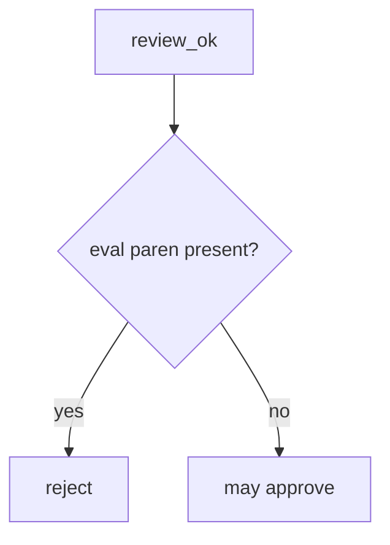

# 9.2-LO-04 — Reject eval in the review predicate

**Kind:** design-exercise
**Loop step:** 4 Build
**Standards:** OWASP ASVS 5.0.0 (final) `v5.0.0-1.3.2`. NIST SSDF 1.1 (final) PW.7. `v5.0.0-15.1.5` is **Level 3, advanced**. SSDF 1.2 IPD is **draft**.

## Structural means the review asks the interpreter question

`review_ok` must be false when the diff contains `eval(`. That is the **lab stand-in** for “user input is not Python grammar.” Structural means that reject — not a formatter, not a 9.4 bot, not documenting eval as dangerous without rejecting it.

The smallest restore for SecureCollab merge gating is: `x = eval(user)` → not approved. Fail-safe: unknown dynamic execution denies in a real review even if this fixture’s substring misses it. Do not treat the denylist as 1.3.2 complete. Do not fail open because CI formatted the file.

## Mental model: fail closed on eval



The lab’s fixed tree uses `'eval(' not in diff`. Name the residual: `exec(`, SpEL, Jinja `|safe`, and generated code (E1) are not this check. Documenting dangerous functionality (`v5.0.0-15.1.5`, Level 3 advanced) without rejecting it is a different false assurance. 9.3 tests are still required after a human reject.

ASVS `v5.0.0-1.3.2` wants that avoid-eval implemented. This pytest is that sentence for the lab string.

## Why this restores the cell

| After the fix | Must be true |
|---|---|
| `x = eval(user)` | `review_ok` false |
| `x = int(user)` | `review_ok` true |

## What this is not

A complete review oracle. A formatter. A 9.4 bot. Documenting eval as dangerous (`v5.0.0-15.1.5`, Level 3) without rejecting it. ChatGPT “looks safe.” SSDF 1.2 IPD as a sticker.

## Mechanism limits

- Substring misses `exec(`, `__import__`, SpEL, Jinja `|safe`.
- Generated code (E1) can reintroduce eval after review.
- Documenting dangerous functionality (`v5.0.0-15.1.5`, Level 3) without rejecting it.
- Tests still required (9.3).

## Practice

Name the residual (substring is a stand-in). Run:

```text
python3 -m pytest labs/9.2/9.2-lab/tests --impl fixed
```

Must pass. Run from the lab directory if collection at repo root is polluted.

## Transfer

Terraform: reject `local-exec` interpolating untrusted names the same way 6.1 rejects a shell string.

## Residual risk

Substring stand-in; generated reintroduction (E1); `exec(` / SpEL; tests still required (9.3).

## Non-goals

Do not weaponize eval. Do not claim Gate 9 from a formatter screenshot. Do not present SSDF 1.2 IPD as final.
