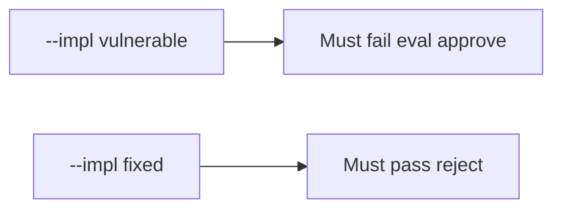

# 9.2-LO-05 — Evidence is eval rejected, then a passing pair

**Kind:** verification-lab
**Loop step:** 5 Verify
**Standards:** OWASP ASVS 5.0.0 (final) `v5.0.0-1.3.2`.

## An invariant that cannot fail a test is still a slogan

“We always LGTM after CI” is not evidence. “Ruff passed” is a mechanism observation. The oracle is: `review_ok("x = eval(user)")` is false and `review_ok("x = int(user)")` may be true. The eval-approve observation must be **false** on `--impl vulnerable` (returns true) and **true** on `--impl fixed`. Do not run eval on live input.

## Mental model: vulnerable must fail: eval approve

The failing observation on `--impl vulnerable` is **eval approve**. A passing collection count is not this cell.



| Mode | Must show for this module |
|---|---|
| Negative / abuse | `eval(user)` → not approved; vulnerable must fail |
| Normal | honest `int(user)` → may approve (may pass on both) |
| Not claimed | complete oracle; SpEL; live GitHub; `exec(` |

Lab tests in `labs/9.2/9.2-lab/tests/test_property.py`. `test_eval_on_user_input_is_rejected` is a **forbidden-outcome** test: always-true `review_ok` is not allowed to count as a passing control.

```text
python3 -m pytest labs/9.2/9.2-lab/tests --impl vulnerable
python3 -m pytest labs/9.2/9.2-lab/tests --impl fixed
```

Honest diffs without eval may pass on both implementations. That does not excuse the eval-reject test. If vulnerable does not fail `test_eval_on_user_input_is_rejected`, the lab is miswired—fix the wiring, not the assertion.

## What the tests do not prove

- That `exec(` is rejected
- That generated code is reviewed (E1)
- That 9.4 bots are honest
- That the substring is a complete 1.3.2 oracle
- Gate 9 complete

Record those as residuals or later modules, not as silent passes.

## Practice

Execute both implementations this session from the lab directory if needed. Write the fail/pass pair next to the matrix row. Reject a “test” that only greps `eval` in a policy PDF without calling `review_ok("x = eval(user)")`.

## Transfer

Clinic: a review that only asserts “template still renders” is not this cell. Live GitHub and weaponized eval are out of scope.

## Non-goals

Do not add a live org trophy. Do not log eval payloads. Keys stay out of this file. Gate 9 stays not-attempted.
