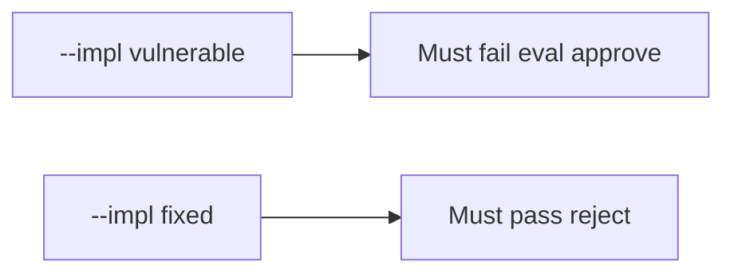

# 9.2-LO-05 — Evidence is eval rejected, then a passing pair

**Kind:** verification-lab
**Loop step:** 5 Verify
**Standards:** OWASP ASVS 5.0.0 (final) `v5.0.0-1.3.2`.

## An invariant that cannot fail a test is still a slogan

“We always LGTM after CI” is not evidence. The oracle is the local pair. Do not run eval on live input.

## Mental model: fail-on-vulnerable, pass-on-fixed



| Case | Must show |
|---|---|
| Negative / abuse | `eval(user)` → not approved |
| Normal | honest `int(user)` → may approve |
| Not claimed | complete oracle; SpEL; live GitHub |

```
python3 -m pytest labs/9.2/9.2-lab/tests --impl vulnerable
python3 -m pytest labs/9.2/9.2-lab/tests --impl fixed
```

Honest diffs without eval may pass on both.

## What the tests do not prove

- That `exec(` is rejected
- That generated code is reviewed (E1)
- That 9.4 bots are honest

## Practice

Execute both implementations. Map each test to an LO-02 question.

## Transfer

Clinic: a review that only asserts “template still renders” is not this cell.
