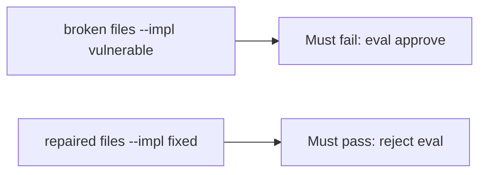

# The broken files must fail an approved eval

**Kind:** verification-lab
**Loop step:** 5 Verify

## Check it

Approving because continuous integration passed does not reject `eval`. A formatter pass is style. `review_ok("x = eval(user)")` has to be false, and `review_ok("x = int(user)")` may be true. Vulnerable path: the eval line still returns true. Repair refuses `eval(` in the diff. Do not run eval on live input.

## Picture: broken must fail eval-approve

Eval on user input can still be approved even when other tests pass.



If the broken review still passes, eval-on-user was never rejected.

## What the check has to show

| Mode | Must show for this topic |
|---|---|
| Normal | Honest `int(user)` may approve (`test_honest_diff_without_eval_may_pass`; may pass on both) |
| Wrong input / abuse | `eval(user)` is not approved; broken files must fail |
| Failure | If you cannot tell whether the diff grants an interpreter, reject |
| Not claimed | complete check; other expression languages; live GitHub; `exec(` |

`test_eval_on_user_input_is_rejected` is what an always-yes `review_ok` cannot pass. Do not add a working eval payload to “make the test more real.” The lab string `x = eval(user)` is enough.

An `eval` mention in a policy PDF is not `review_ok("x = eval(user)")`. This practice never runs eval on live input.

```text
python3 -m pytest labs/9.2/9.2-lab/tests --impl vulnerable
python3 -m pytest labs/9.2/9.2-lab/tests --impl fixed
```

A diff that never calls eval is the honest path. Reject eval on a user string. If the broken files do not fail `test_eval_on_user_input_is_rejected`, the lab is miswired — fix the wiring, not the assertion. A setup error is not proof the rule holds.

## What the tests do not prove

- That `exec(` is rejected
- That generated code is reviewed (later elective)
- That later review bots are honest
- That the substring is a complete avoid-eval check
- That a course gate is done

## Practice

Call `review_ok("x = eval(user)")`. An `eval` mention in a policy PDF is a warning, not a reject.

## Use it somewhere new

A template that still renders is style, not `review_ok` on eval. Do not use live GitHub or weaponized eval.

## What this page is not doing

A live org screenshot is not `review_ok` rejecting eval. Do not log eval payloads. Answer keys are not on this site. This site does not mark you as finished.
