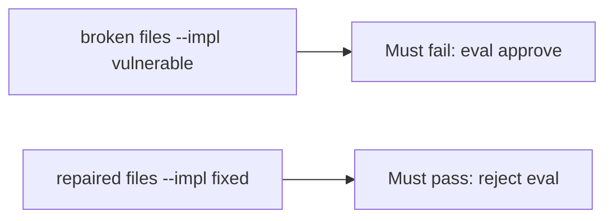

# The broken files must fail an approved eval

**Kind:** verification-lab
**Loop step:** 5 Verify

## Check it

“We always approve after continuous integration” is not evidence. “The formatter passed” is a tool observation. The check is: `review_ok("x = eval(user)")` is false and `review_ok("x = int(user)")` may be true. The eval-approve observation must be **false** on `--impl vulnerable` (returns true) and **true** on `--impl fixed`. Do not run eval on live input.

## Picture: broken must fail eval-approve

A check that only counts passing cases can still look green while eval on user input is still approved.



If both pass, the test is not looking at eval-on-user. If both fail, the fix is not structural or the check is wrong.

## What the check has to show

| Mode | Must show for this topic |
|---|---|
| Normal | Honest `int(user)` may approve (`test_honest_diff_without_eval_may_pass`; may pass on both) |
| Wrong input / abuse | `eval(user)` is not approved; broken files must fail |
| Failure | If you cannot tell whether the diff grants an interpreter, reject |
| Not claimed | complete oracle; other expression languages; live GitHub; `exec(` |

The file is `labs/9.2/9.2-lab/tests/test_property.py`. The test `test_eval_on_user_input_is_rejected` is there so always-true `review_ok` cannot sneak through. Do not add a working eval payload to “make the test more real.” The lab string `x = eval(user)` is enough.

A test that only greps `eval` in a policy PDF without calling `review_ok("x = eval(user)")` is not this topic’s evidence. This practice never runs eval on live input.

```text
python3 -m pytest labs/9.2/9.2-lab/tests --impl vulnerable
python3 -m pytest labs/9.2/9.2-lab/tests --impl fixed
```

Honest diffs without eval may pass on both implementations. That does not excuse the eval-reject test. If the broken files do not fail `test_eval_on_user_input_is_rejected`, the lab is miswired — fix the wiring, not the assertion. A setup error is not proof the rule holds.

## What the tests do not prove

- That `exec(` is rejected
- That generated code is reviewed (later elective)
- That later review bots are honest
- That the substring is a complete avoid-eval oracle
- That a course gate is done

## Practice

Run both this session from the lab directory if needed:

```text
python3 -m pytest labs/9.2/9.2-lab/tests --impl vulnerable
python3 -m pytest labs/9.2/9.2-lab/tests --impl fixed
```

Paste nothing from answer keys. Write fail/pass into your notes next to the matrix row. Reject a “test” that only greps `eval` in a policy PDF without calling `review_ok("x = eval(user)")`.

## Use it somewhere new

A clinic example: a review that only asserts “template still renders” is not this check. Live GitHub and weaponized eval are out of scope.

## What this page is not doing

Do not treat a live org screenshot as proof. Do not log eval payloads. Answer keys are not on this site. This site does not mark you as finished.
