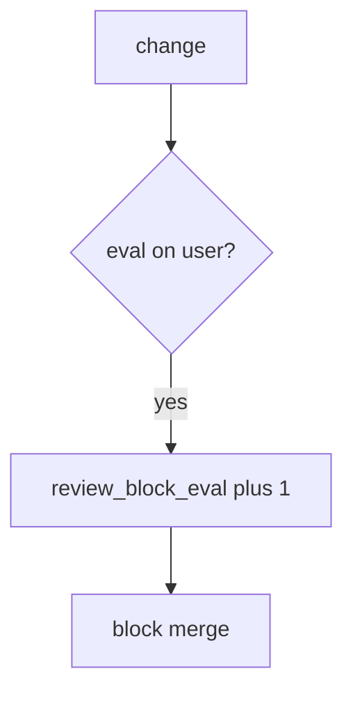

# Block eval in review without logging the payload

**Kind:** operations-exercise
**Loop step:** 6 Operate

## Fixing it once is not enough

Even after `review_ok` was “fixed once,” a later generated helper can put eval back. Running it for real is the rest of the loop: notice, contain, and recover.

Do not log the user string that would have been eval’d. Do not paste template source with patient fields into chat.

## Picture: eval in a change is a signal

When you see a pull request whose diff still grants `eval` on a user string, leave the payload off the pager. Then block the merge and keep the reject.



A bot-vendor name does not prove avoid-eval. Someone still has to own the always-approve path.

## Signals that do not become a second leak

| Outcome | This topic |
|---|---|
| Notice | `review_block_eval` |
| What the line holds | change id, file, reason=eval; **never** the payload |
| Respond | Block merge |
| Recover | Keep reject; add tests (9.3); review generated code |
| Leftover | Substring stand-in; generated code; later review bots |

```text
log_denied reason=review_block_eval pr=pr_92e file=export.py
```

Not: an eval payload, a note body, or a live GitHub trace.

Putting the eval payload or note bodies in the alert leaves a second copy (logging topic / interpreter topic) in the pager.

A green “formatter passed” tile is not that check. Re-run `test_eval_on_user_input_is_rejected` after any review-bot change. Terraform `local-exec` and GitHub Actions `run:` are other interpreter paths — inventory them before claiming recover. The lab substring is a stand-in: an `exec(` helper can skip it, so keep the human interpreter question even after this metric is green.

## What the framework does vs what you still have to check

A GitHub checks dashboard will show the formatter green and stay silent when `review_ok` is always true. Detection must observe **eval-on-user rejected**, not check count. If the alert includes the eval payload or note bodies, you have opened a second leak.

## Practice

```text
log_denied reason=review_block_eval pr=pr_92e file=export.py
```

Reject any line that includes eval payloads, note bodies, or a live GitHub trace.

## Use it somewhere new

Block a template change; do not paste the template source with patient fields into chat. Do not run eval on live input.

## Can people still use it

A blocked review must say *why* in plain language (eval on user input), not only a policy code. Color or a code alone is not enough.

## What this page is not doing

A bot-vendor name is not the rule. This site does not mark you as finished. Answer keys are not on this site.
