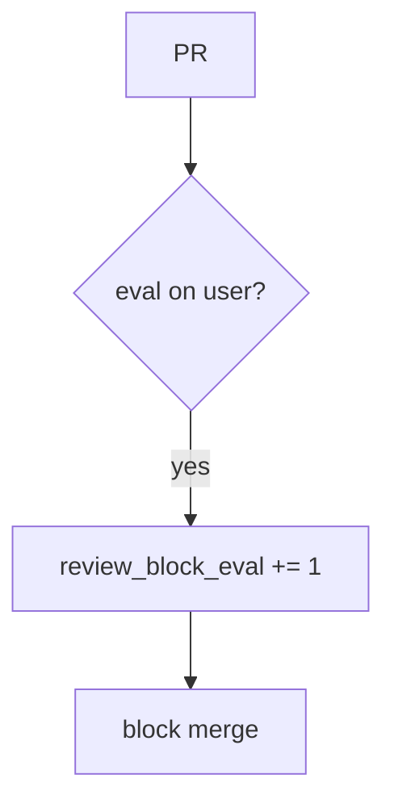

# 9.2-LO-06 — Detect review_block_eval without logging the payload

**Kind:** operations-exercise
**Loop step:** 6 Operate
**Standards:** NIST CSF 2.0 (final) DE/RS/RC as outcome labels; NIST SSDF 1.1 PW.7 / RV.1.

## Prevention is not absolute

A later generated helper can reintroduce eval. Pair detect and recover. Do not log the user string that would have been eval’d (3.1).

## Mental model: eval in a PR is a signal



| Outcome | This module |
|---|---|
| Detect | `review_block_eval` |
| Signal | PR id, file, reason=eval; never the payload |
| Recover | Keep reject; add 9.3 tests; review generated code |
| Residual | Substring stand-in; E1; 9.4 bots |

## Practice

Write one log line you would accept. Tie it to `labs/9.2/9.2-lab`.

```
log_denied reason=review_block_eval pr=pr_92e file=export.py
```

Reject any line that includes `eval(user)` payloads, note bodies, or a live GitHub trace.

## Transfer

Clinic: block a template PR; do not paste the template source with patient fields into Slack.

## Non-goals

A bot-vendor name is not the property. Gate 9 stays not-attempted.
