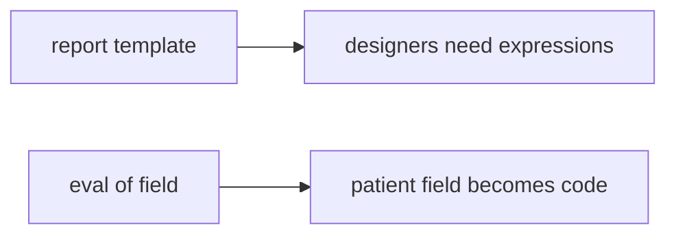

# Same idea when a clinic report template uses eval

**Kind:** transfer-challenge
**Loop step:** 7 Transfer

## Use it somewhere new

You get a **clinic report template** where designers can put expressions.

On the notes app, `review_ok("x = eval(user)")` must be false. For a clinic, eval on user input is not approved; honest `int(user)` may pass.

Also name Terraform `local-exec` and GitHub Actions yaml as the same interpreter family, without running those systems.

**Product sketch:** a small records app — “designers can put expressions in the discharge template,” plus “continuous integration formatted the file so we approved it.”

## Picture: same interpreter, clinical object

Renaming “export helper” to “report template” is not transfer.

| Notes app this week | Clinic sketch |
|---|---|
| `x = eval(user)` approved | Template eval of a patient field approved |
| `review_ok` | Template-change review helper |
| `'eval(' not in diff` stand-in | Same stand-in on a local practice files |
| Optimistic reviewer | Compromised designer — **not** a live clinic |

If designers “need expressions” while `review_ok` is always true, the check is gone. Formatter continuous integration, a linter, and “a bot reviewed it” (later, 9.4) do not ask the interpreter question. Terraform `local-exec` and GitHub Actions `run:` are the same interpreter family — name them, do not run those systems here. The lab substring is a stand-in, not a complete oracle.

Eval-on-user still has to be rejected. Honest `int(user)` may still pass. Formatting the template without an interpreter question leaves `review_ok` true. The local check is `test_eval_on_user_input_is_rejected` — on a practice, not a live GitHub org.

## Prompt — clinic eval in a report template

1. who can act (template author / compromised designer — not a live clinic);
2. what you trust (review of interpreters is what you trust; formatter “looks good” is not);
3. what must not happen (`review_ok` true for eval-on-user, not a legal label);
4. a test idea on a **local** practice files only (no weaponized eval — never on the real clinic);
5. leftover (substring stand-in, `exec(`, generated templates, later elective);
6. whether a human-read “change blocked” status must say “eval on user input,” not only a code (readable error, not color alone).

## What is not good enough

| Reject | Why |
|---|---|
| “Formatter passed” | Not an interpreter review |
| Weaponized eval / live GitHub | Course rules |
| “A bot reviewed it” | Later bots are a help, not this week |
| Documented as dangerous, still merged | Writing it down is not reject |
| Draft vocabulary as certified | Draft; not a course gate |

## Practice

One page. No answer keys. The only running system you may break is `labs/9.2/9.2-lab`. Do not run eval on untrusted input.

## What this page is not doing

Weaponized eval. Live orgs. Claiming a course gate from this page.
